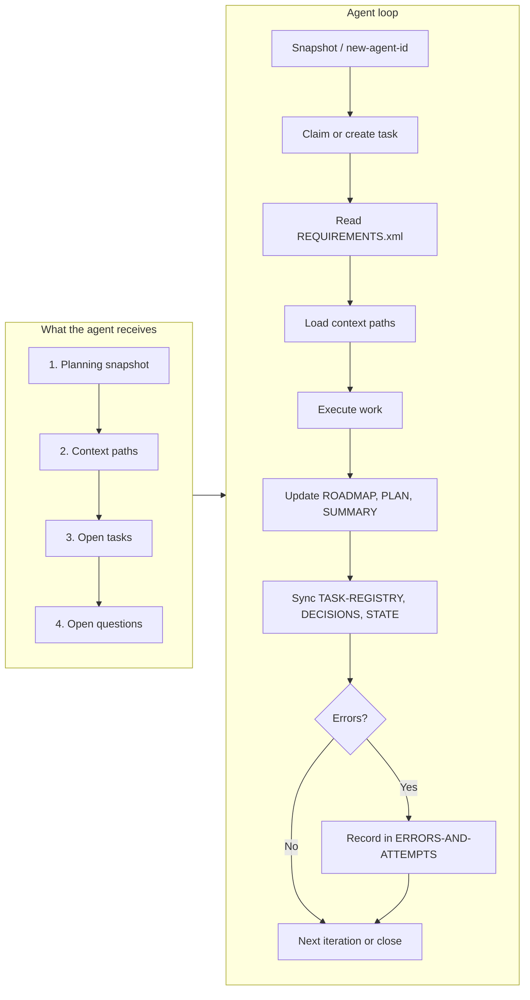
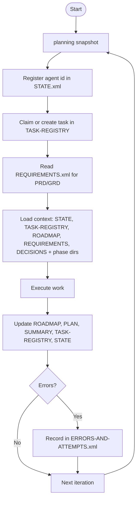

══════════════════════════════════════════════════════════════
  AGENT LOOP REPORT
══════════════════════════════════════════════════════════════

**Generated:** 2026-03-04T18:20:12.493Z  
**Format:** planning-agent-context/1.0

<details>
<summary><strong>KPIs — token usage, context per sprint phase</strong></summary>

Same as CLI: <code>planning kpis</code>

```text
PRD / REQUIREMENTS.xml
Total chars: 225320 · tokens ≈ 56339

Sprint 7 (phases: 51, 52, 53)
Task count: 38 · task-text tokens ≈ 1976
Context tokens per phase (phase dirs):

51 (51-content-schema-file-test-mode-authoring-loop): ≈ 1511 tokens (6044 chars)
52 (52-unreal-dlc-content-delivery): ≈ 4272 tokens (17086 chars)
53 (53-dolt-lineage-and-authoring-governance): ≈ 905 tokens (3619 chars)

Sprint total (phase dirs + task text): ≈ 8664 tokens
```
</details>

<details>
<summary><strong>What is an agent’s workflow? (summary)</strong></summary>

1. **Snapshot** → `planning snapshot` (or `new-agent-id`) shows current phase, plan, agents, open tasks, phase progress.
2. **Get an ID** → `planning new-agent-id` prints a new id on one line (e.g. `agent-20250303-abcd`). The agent registers it in STATE.xml under `agent-registry`.
3. **Claim work** → Claim or create a task in TASK-REGISTRY.xml (phase, goal, commands).
4. **Read context** → When using the CLI (`planning simulate loop`), the bundle **serves** STATE, TASK-REGISTRY, ROADMAP, DECISIONS, and sprint phase dirs (and **always serves coding conventions**, e.g. AGENTS.md). The agent is also directed to **code file references** (from task commands + config) for implementation context.
5. **Execute** → Do the task; update ROADMAP, phase PLAN/SUMMARY; sync TASK-REGISTRY, DECISIONS, STATE.
6. **Errors** → Record in ERRORS-AND-ATTEMPTS.xml if needed.

**Outputs / references:** STATE.xml, TASK-REGISTRY.xml, ROADMAP.xml, REQUIREMENTS.xml, DECISIONS.xml, `.planning/phases/<phase>/` (PLAN.xml, SUMMARY.xml), `.planning/reports/` (this report).
</details>

<details>
<summary><strong>System health — track &amp; analyze</strong></summary>

Current snapshot (also in <code>.planning/reports/metrics.jsonl</code>; one line per <code>planning report generate</code>). Use <code>planning metrics</code> / <code>planning metrics-history --n 30</code> or fetch <code>http://localhost:3847/metrics?tail=50</code> when report server is running.

| Metric | Value |
|--------|-------|
| At | 2026-03-04T18:20:12.556Z |
| Tasks | 70 / 79 (89% done) |
| Open questions | 16 |
| Active agents | 2 |
| Phases (with tasks / total / complete) | 8 / 38 / 23 |
| Errors/attempts (ERRORS-AND-ATTEMPTS.xml) | 4 |
| Review (phases at 0% / unassigned / only planned) | 4 / 4 / 3 |
| Snapshot tokens (approx) | 1900 |
| Bundle tokens (simulate loop, approx) | 39347 |
</details>

<details>
<summary><strong>THINGS TO REVIEW</strong></summary>

Same as CLI: <code>planning review</code>

```text
Phases at 0% progress (e.g. 46: 0/1, 49: 0/1) or unassigned tasks may be skipped or abandoned. Use planning review to list them; planning review --json to output data for tools or APIs.

Phases at 0% (skipped/abandoned?)

Phase	Title	Tasks	Suggestion
46	Human-playable input UX hardening	46-01	Phase may be skipped or abandoned; consider assigning work or closing/superseding tasks.
49	Dungeon Explorer spatial visualization	49-01	Phase may be skipped or abandoned; consider assigning work or closing/superseding tasks.
52	Unreal DLC content delivery pipeline and plugin integration	52-01, 52-02, 52-03, 52-04	Phase may be skipped or abandoned; consider assigning work or closing/superseding tasks.
53	Dolt lineage and authoring governance workflow	53-01	Phase may be skipped or abandoned; consider assigning work or closing/superseding tasks.

Unassigned tasks (agent-## or empty)

Task	Phase	Status	Suggestion
46-01	46	planned	Task has no real agent assigned; assign or use agent-## as placeholder until claimed.
51-03	51	planned	Task has no real agent assigned; assign or use agent-## as placeholder until claimed.
52-03	52	planned	Task has no real agent assigned; assign or use agent-## as placeholder until claimed.
53-01	53	planned	Task has no real agent assigned; assign or use agent-## as placeholder until claimed.

Phases with only planned work (no in-progress)

Phase	Title	Tasks	Suggestion
46	Human-playable input UX hardening	46-01	No task in progress; may need prioritization or an agent to claim work.
51	Content schema file test-mode authoring loop	51-03	No task in progress; may need prioritization or an agent to claim work.
53	Dolt lineage and authoring governance workflow	53-01	No task in progress; may need prioritization or an agent to claim work.
```
</details>


──────────────────────────────────────────────────────────────
  AGENT ID: what the agent sees (verbatim)
──────────────────────────────────────────────────────────────

When an agent runs **`planning new-agent-id`**, it receives exactly the following. (First: full snapshot. Then: one line with the new id.)

**1. Snapshot (exact stdout):**

```text
BEHAVIOR (AGENTS.md)

# Agent Loop Guide

XML-first planning. Use `.planning/templates/` for PLAN, SUMMARY, ROADMAP, TASK-REGISTRY, DECISIONS. Cite PRD/GRD in `references`.

**Quick start:** We have a planning CLI—run it to start. Run `planning snapshot` (or `pnpm planning snapshot` / `node scripts/loop-cli.mjs snapshot`) → register agent id in STATE.xml → claim task in TASK-REGISTRY.xml → read REQUIREMENTS.xml for phase. **When the planning MCP server (dungeonbreak-planning) is available,** prefer its tools (snapshot, open_questions, get_agent_bundle, task_update, etc.) so all agents use the same orchestration surface. **Workflow:** Update ROADMAP, phase PLAN/SUMMARY; sync TASK-REGISTRY, DECISIONS, STATE; add `requriements-suggestions` for gaps; record errors in ERRORS-AND-ATTEMPTS.xml. **Identity:** Unique `agent-YYYYMMDD-xxxx` in STATE; `planning new-agent-id`. **Loop:** Include snapshot in updates when asked; close tasks and set inactive when done; compact refs; don’t block on open questions—capture in `requriements-suggestions`.

---

# Coding Standards &amp; Styling

**Format &amp; lint:** `pnpm dlx ultracite fix` / `ultracite check`. Biome handles most formatting; run before commit.

**TypeScript:** Explicit types where they help; `unknown` over `any`; const assertions; type narrowing over assertions; named constants over magic numbers.

**TS/JS:** Arrow callbacks; `for...of`; `?.` and `??`; template literals; destructuring; `const` by default.

**React:** Function components; hooks at top level only; full dependency arrays; unique `key` (not index); semantic HTML + ARIA (alt, headings, labels, keyboard + mouse, `&lt;button&gt;`/`&lt;nav&gt;`); no components defined inside components.

**DRY &amp; SOLID:** Don’t repeat yourself—extract shared logic and UI into reusable pieces. Single responsibility, open/closed, clear dependencies. Prefer composition over duplication.

**Components &amp; UI (don’t reinvent the wheel):** Use **shadcn/ui** first. Check the [shadcn registry](https://ui.shadcn.com) and 3rd party components built on shadcn (or Radix). Prefer lightweight, well-maintained 3rd party over custom builds. Only build custom when nothing fits.

**Icons:** Use icons for context—they’re reusable and condensed. Prefer a consistent icon set (e.g. Lucide, Radix Icons) over text labels or one-off SVGs. Use icons for actions, status, and navigation so UI stays scannable and DRY.

**UI aesthetic (senior stylist):** Emulate **PostHog-style dashboard** on **compact editor density** (Unreal/Unity-inspired). Goal: good-looking, organized UI.

- **PostHog traits:** Vibrant purple primary (#5B21B6 → #A78BFA gradient); white/near-white cards (bg-white/95 dark:bg-slate-900/80); sharp shadows (shadow-md hover:shadow-xl); bold typography (font-semibold text-base+); metric cards border-none with divider lines; charts with glassmorphism overlays.
- **Core tokens:** primary purple-500/600 (#A78BFA/#7C3AED), accent indigo-500, success green-500, bg-card white dark:slate-900/90.
- **Cards:** bg-card border-0 shadow-lg rounded-xl p-4–6 hover:shadow-2xl transition-all duration-200.
- **Typography:** text-foreground font-medium tracking-tight; text-lg for headers.
- **Metrics/Charts:** Full-width, border-t pt-4 after:border-muted/50, hover:scale-[1.02].
- **Buttons:** bg-gradient-to-r from-purple-500 to-indigo-600 hover:from-purple-600 text-white shadow-lg.
- **Layout:** Mobile stack; desktop grid-1 md:grid-cols-3 for dashboards. Extend theme (colors/shadows) in config, not one-off classes.

**When delivering UI changes:** Provide refactored TSX, config diff (colors/shadows), checklist, and **PostHog vibe score (High/Med/Low)** so we keep the aesthetic consistent.

**Styling (general):** Design tokens over magic colors; semantic class names; co-located or clear structure; Next.js `&lt;Image&gt;` where applicable.

**Errors &amp; flow:** Early returns over deep nesting; throw `Error` with clear messages; remove `console.log`/`debugger` from commits.

**Security:** `rel=&#34;noopener&#34;` with `target=&#34;_blank&#34;`; avoid `dangerouslySetInnerHTML` unless required; no `eval()`.

**Perf:** Prefer **O(1)** or **O(n log n)** over O(n) or worse; only use higher complexity when unavoidable and document why. No spread in loop accumulators; top-level regex; specific imports; proper image components. Use sets/maps for lookups; avoid repeated linear scans; sort once if needed (n log n) rather than repeated O(n) passes.

**Tests:** Assert inside `it()`/`test()`; async/await not done callbacks; no `.only`/`.skip` in repo.

Consider these when editing; run `pnpm dlx ultracite fix` before committing.


────────────────────────────────────────

STATE (.planning/STATE.xml)
agents (active):
  agent-20260303-v2nt  phase=44 plan=44-25  26/27 (96%)
    task 49-01 [in-progress] Dungeon Explorer spatial visualization plan + layout payload…
  agent-20260303-2oyq  phase=52 plan=52-02  5/9 (56%)
    task 50-12 [in-progress] Run end-to-end chat-authoring verification in Space Explorer…
    task 52-01 [in-progress] Define Unreal DLC delivery phase baseline: add DB_Unreal_DLC…
    task 52-02 [in-progress] Define Supabase/S3 delivery contract and implement encrypted…
    task 52-04 [in-progress] Document end-to-end content delivery workflow in docs-site (…

OPEN TASKS (.planning/TASK-REGISTRY.xml)
  46-01 [planned] Human-playable UX hardening (agent: agent-##)
  49-01 [in-progress] Dungeon Explorer spatial visualization plan + layout payload. (agent: agent-20260303-v2nt)
  50-12 [in-progress] Run end-to-end chat-authoring verification in Space Explorer and finalize release readiness checks for this phase. (agent: agent-20260303-2oyq)
  51-03 [planned] Define Supabase/S3 pull/push contracts for content-pack bundles and reports, including indexing/versioning and upload provenance. (agent: agent-##)
  52-01 [in-progress] Define Unreal DLC delivery phase baseline: add DB_Unreal_DLC_Plugin submodule and create implementation plan for downloadable packs, ingestion contracts, schema/asset alignment, and secret handling. (agent: agent-20260303-2oyq)
  52-02 [in-progress] Define Supabase/S3 delivery contract and implement encrypted env bundle workflow for docs-site + Unreal plugin cross-repo operations. (agent: agent-20260303-2oyq)
  52-03 [planned] Implement content pack publish/pull API contract with versioned manifest index and signed Supabase download URLs. (agent: agent-##)
  52-04 [in-progress] Document end-to-end content delivery workflow in docs-site (Content Editor, Supabase distribution, Unreal plugin consumption, Dolt lineage role), including audience and expectations. (agent: agent-20260303-2oyq)
  53-01 [planned] Define Dolt authoring lineage workflow contract: branch strategy, merge gates, release promotion semantics, and ownership model. (agent: agent-##)

PHASE
  Progress (.planning/TASK-REGISTRY.xml)
    44: 26/26 (100%)
    45: 1/1 (100%)
    46: 0/1 (0%)  review?
    49: 0/1 (0%)  review?
    50: 11/12 (92%)
    51: 32/33 (97%)
    52: 0/4 (0%)  review?
    53: 0/1 (0%)  review?

  NEEDS REVIEW
    46, 49, 52, 53
  DEPS (tree, id title [status]) (.planning/ROADMAP.xml) — file context
    51 Content schema file test-mod [active]
    52 Unreal DLC content delivery  [active]
      └ 53 Dolt lineage and authoring g [plan]

  Similar phases  (phase↔phase similarity%  files touched)
    51↔52 74%  docs-site, .secrets/env.bundle.sealed.json, content/docs, scripts/env-bundle.mjs
    51↔53 74%  docs-site, docs-site/content-packs
    52↔53 75%  .secrets/env.bundle.sealed.json, docs-site, content/docs, scripts/env-bundle.mjs, docs-site/content-packs
```

**2. Then one line (exact stdout):**

```text
Your new agent id: agent-20260304-repr
```

The agent adds the printed id to STATE.xml under `agent-registry` (and optionally sets phase, plan, status). **Who’s working** = agents that have claimed an id (listed in STATE.xml). Below: count and list of those agents and the **context** (task goals, phase titles) they see.


──────────────────────────────────────────────────────────────
  AGENTS IN THE REPO (2 with claimed IDs)
──────────────────────────────────────────────────────────────


- **agent-20260303-v2nt** — name: codex | phase: 44 | plan: 44-25 | status: in-progress
  <details>
  <summary>Tasks &amp; context (what this agent reads)</summary>
  
  | Task | Status | Goal | Phase |
  |------|--------|------|-------|
  | 44-01 | done | Atomic UI foundation for KAPLAY | 44 (KAPLAY atomic component library baseline) |
  | 44-02 | done | XML planning docs template adoption | 44 (KAPLAY atomic component library baseline) |
  | 44-03 | done | Consolidate root planning markdown into XML + regenerate roadmap + migrate phase docs | 44 (KAPLAY atomic component library baseline) |
  | 44-04 | done | Clean XML references + update README/STATE/TASK registry for XML-only loop | 44 (KAPLAY atomic component library baseline) |
  | 44-05 | done | Space Explorer panel naming + info-icon context styling + explicit UI IDs for discoverable change requests. | 44 (KAPLAY atomic component library baseline) |
  | 44-06 | done | Consolidate reachability/deltas into visualization toolbar and add distance algorithm + top-k controls. | 44 (KAPLAY atomic component library baseline) |
  | 44-07 | done | Unify visualization viewport behavior so Deltas replaces the same area as 3D/JSON; remove entity tile; promote reachability rows to header badges. | 44 (KAPLAY atomic component library baseline) |
  | 44-08 | done | Convert Space Explorer to single-step space selection by moving Combined into Space View and adding direct Skill/Dialogue/Archetype modes. | 44 (KAPLAY atomic component library baseline) |
  | 44-09 | done | Replace static content/nav panels with space-scoped feature vectors and movement vector authoring controls; remove Behavior Lens. | 44 (KAPLAY atomic component library baseline) |
  | 44-10 | done | Add Model Schema popup and show active Kael model clearly while inspecting schema references. | 44 (KAPLAY atomic component library baseline) |
  | 44-11 | done | Replace flat model selector with a hierarchical tree (react-arborist) grouped by model namespace for schema comprehension. | 44 (KAPLAY atomic component library baseline) |
  | 44-12 | done | Make model tree interactive with child instances and canonical content bindings (Kael under model + canonical toggle serialization). | 44 (KAPLAY atomic component library baseline) |
  | 44-13 | done | Fix duplicate React key in space features and remove bottom Model Schema Builder section from Space Explorer. | 44 (KAPLAY atomic component library baseline) |
  | 44-14 | done | Optimize model schema interactions with zustand/immer state slicing and add tree-level canonical asset authoring with multi-language schema views. | 44 (KAPLAY atomic component library baseline) |
  | 44-15 | done | Persist Space Explorer authoring state and add drag-to-migrate model instance workflow with copyable migration script/code blocks. | 44 (KAPLAY atomic component library baseline) |
  | 44-16 | done | Improve model authoring handoff by moving `(base)` to namespace-level context, enabling feature-ref default editing, and generating inheritance-aware TS/C++/C# schema file lists. | 44 (KAPLAY atomic component library baseline) |
  | 44-17 | done | Simplify Space Explorer controls by removing 3D marker grouping and reducing Space Features UI to direct vector editing. | 44 (KAPLAY atomic component library baseline) |
  | 44-18 | done | Align space selection with model schema by replacing space cards with a model-derived dropdown and promoting Model Space View as the section title. | 44 (KAPLAY atomic component library baseline) |
  | 44-19 | done | Add explicit model picker from model-schema list and support creating new model schemas directly inside the model tree modal. | 44 (KAPLAY atomic component library baseline) |
  | 44-20 | done | Use model tree as model-space selection source and add multi-model checkbox overlays for concurrent model-space visualization in 3D. | 44 (KAPLAY atomic component library baseline) |
  | 44-21 | done | Remove Model Space controls, show model-space overlays by inheritance chain, and split feature controls by inheritance levels. | 44 (KAPLAY atomic component library baseline) |
  | 44-22 | done | Add reusable combatstats schema layer with default stat vectors and explicit entity/item inheritance in schema generation and model tree UX. | 44 (KAPLAY atomic component library baseline) |
  | 44-23 | done | Flatten Stat Control UI (remove movement + merge panels) and introduce CurrencyStats/currency inheritance as reusable model stat vectors. | 44 (KAPLAY atomic component library baseline) |
  | 44-24 | done | Bind Space Explorer reports to content-pack identity with hash mismatch visibility and enforce canonical-first model selection; emit play-report binding artifacts in CI/release pipelines. | 44 (KAPLAY atomic component library baseline) |
  | 44-25 | done | Generate portable content-pack manifest/schema/code stubs from bundle data and wire traceable pack bindings through Space Explorer and play-report APIs. | 44 (KAPLAY atomic component library baseline) |
  | 45-01 | done | Add spatial transforms to dungeon, rooms, entities, and items; render in dungeon explorer. | 45 (Grid and first-person screen refit completion) |
  | 49-01 | in-progress | Dungeon Explorer spatial visualization plan + layout payload. | 49 (Dungeon Explorer spatial visualization) |
  
  
  </details>

- **agent-20260303-2oyq** — name: codex | phase: 52 | plan: 52-02 | status: in-progress
  <details>
  <summary>Tasks &amp; context (what this agent reads)</summary>
  
  | Task | Status | Goal | Phase |
  |------|--------|------|-------|
  | 50-07 | done | Define and lock product-level DoD for Phase 50: working in-app chat authoring in Space Explorer with Codex, canonical assets, and serializable content bundle outputs. | 50 (AI integration architecture and schema-authoring workflows) |
  | 50-08 | done | Embed chat interface in Space Explorer and wire Codex/app-server session lifecycle with feature-flag gating. | 50 (AI integration architecture and schema-authoring workflows) |
  | 50-09 | done | Implement chat-driven editing flows for model definitions, stats, and content schema entities with validation feedback. | 50 (AI integration architecture and schema-authoring workflows) |
  | 50-10 | done | Enable canonical data asset creation/update via chat and connect authored assets to model/content bindings. | 50 (AI integration architecture and schema-authoring workflows) |
  | 50-11 | done | Ensure authored content serializes into production bundle outputs (content + canonical assets), not schema-only artifacts. | 50 (AI integration architecture and schema-authoring workflows) |
  | 50-12 | in-progress | Run end-to-end chat-authoring verification in Space Explorer and finalize release readiness checks for this phase. | 50 (AI integration architecture and schema-authoring workflows) |
  | 52-01 | in-progress | Define Unreal DLC delivery phase baseline: add DB_Unreal_DLC_Plugin submodule and create implementation plan for downloadable packs, ingestion contracts, schema/asset alignment, and secret handling. | 52 (Unreal DLC content delivery pipeline and plugin integration) |
  | 52-02 | in-progress | Define Supabase/S3 delivery contract and implement encrypted env bundle workflow for docs-site + Unreal plugin cross-repo operations. | 52 (Unreal DLC content delivery pipeline and plugin integration) |
  | 52-04 | in-progress | Document end-to-end content delivery workflow in docs-site (Content Editor, Supabase distribution, Unreal plugin consumption, Dolt lineage role), including audience and expectations. | 52 (Unreal DLC content delivery pipeline and plugin integration) |
  
  
  </details>


──────────────────────────────────────────────────────────────
  WHAT THE AGENT SEES (literal inputs in workflow order)
──────────────────────────────────────────────────────────────

Exact CLI/bundle output the agent receives; each input is in a code block below.

**Current (focal):** STATE has a single **current-phase** and **current-plan** — the repo’s chosen focus (e.g. phase 50, plan 50-09). That is “who is current” at the repo level. **Phases with in-progress work** can be several: any phase that has an agent with status `in-progress` or a task with status `in-progress`. Right now: 44, 49, 50, 52.

**1. SNAPSHOT (exact stdout of planning snapshot / new-agent-id)**

```text
BEHAVIOR (AGENTS.md)

# Agent Loop Guide

XML-first planning. Use `.planning/templates/` for PLAN, SUMMARY, ROADMAP, TASK-REGISTRY, DECISIONS. Cite PRD/GRD in `references`.

**Quick start:** We have a planning CLI—run it to start. Run `planning snapshot` (or `pnpm planning snapshot` / `node scripts/loop-cli.mjs snapshot`) → register agent id in STATE.xml → claim task in TASK-REGISTRY.xml → read REQUIREMENTS.xml for phase. **When the planning MCP server (dungeonbreak-planning) is available,** prefer its tools (snapshot, open_questions, get_agent_bundle, task_update, etc.) so all agents use the same orchestration surface. **Workflow:** Update ROADMAP, phase PLAN/SUMMARY; sync TASK-REGISTRY, DECISIONS, STATE; add `requriements-suggestions` for gaps; record errors in ERRORS-AND-ATTEMPTS.xml. **Identity:** Unique `agent-YYYYMMDD-xxxx` in STATE; `planning new-agent-id`. **Loop:** Include snapshot in updates when asked; close tasks and set inactive when done; compact refs; don’t block on open questions—capture in `requriements-suggestions`.

---

# Coding Standards &amp; Styling

**Format &amp; lint:** `pnpm dlx ultracite fix` / `ultracite check`. Biome handles most formatting; run before commit.

**TypeScript:** Explicit types where they help; `unknown` over `any`; const assertions; type narrowing over assertions; named constants over magic numbers.

**TS/JS:** Arrow callbacks; `for...of`; `?.` and `??`; template literals; destructuring; `const` by default.

**React:** Function components; hooks at top level only; full dependency arrays; unique `key` (not index); semantic HTML + ARIA (alt, headings, labels, keyboard + mouse, `&lt;button&gt;`/`&lt;nav&gt;`); no components defined inside components.

**DRY &amp; SOLID:** Don’t repeat yourself—extract shared logic and UI into reusable pieces. Single responsibility, open/closed, clear dependencies. Prefer composition over duplication.

**Components &amp; UI (don’t reinvent the wheel):** Use **shadcn/ui** first. Check the [shadcn registry](https://ui.shadcn.com) and 3rd party components built on shadcn (or Radix). Prefer lightweight, well-maintained 3rd party over custom builds. Only build custom when nothing fits.

**Icons:** Use icons for context—they’re reusable and condensed. Prefer a consistent icon set (e.g. Lucide, Radix Icons) over text labels or one-off SVGs. Use icons for actions, status, and navigation so UI stays scannable and DRY.

**UI aesthetic (senior stylist):** Emulate **PostHog-style dashboard** on **compact editor density** (Unreal/Unity-inspired). Goal: good-looking, organized UI.

- **PostHog traits:** Vibrant purple primary (#5B21B6 → #A78BFA gradient); white/near-white cards (bg-white/95 dark:bg-slate-900/80); sharp shadows (shadow-md hover:shadow-xl); bold typography (font-semibold text-base+); metric cards border-none with divider lines; charts with glassmorphism overlays.
- **Core tokens:** primary purple-500/600 (#A78BFA/#7C3AED), accent indigo-500, success green-500, bg-card white dark:slate-900/90.
- **Cards:** bg-card border-0 shadow-lg rounded-xl p-4–6 hover:shadow-2xl transition-all duration-200.
- **Typography:** text-foreground font-medium tracking-tight; text-lg for headers.
- **Metrics/Charts:** Full-width, border-t pt-4 after:border-muted/50, hover:scale-[1.02].
- **Buttons:** bg-gradient-to-r from-purple-500 to-indigo-600 hover:from-purple-600 text-white shadow-lg.
- **Layout:** Mobile stack; desktop grid-1 md:grid-cols-3 for dashboards. Extend theme (colors/shadows) in config, not one-off classes.

**When delivering UI changes:** Provide refactored TSX, config diff (colors/shadows), checklist, and **PostHog vibe score (High/Med/Low)** so we keep the aesthetic consistent.

**Styling (general):** Design tokens over magic colors; semantic class names; co-located or clear structure; Next.js `&lt;Image&gt;` where applicable.

**Errors &amp; flow:** Early returns over deep nesting; throw `Error` with clear messages; remove `console.log`/`debugger` from commits.

**Security:** `rel=&#34;noopener&#34;` with `target=&#34;_blank&#34;`; avoid `dangerouslySetInnerHTML` unless required; no `eval()`.

**Perf:** Prefer **O(1)** or **O(n log n)** over O(n) or worse; only use higher complexity when unavoidable and document why. No spread in loop accumulators; top-level regex; specific imports; proper image components. Use sets/maps for lookups; avoid repeated linear scans; sort once if needed (n log n) rather than repeated O(n) passes.

**Tests:** Assert inside `it()`/`test()`; async/await not done callbacks; no `.only`/`.skip` in repo.

Consider these when editing; run `pnpm dlx ultracite fix` before committing.


────────────────────────────────────────

STATE (.planning/STATE.xml)
agents (active):
  agent-20260303-v2nt  phase=44 plan=44-25  26/27 (96%)
    task 49-01 [in-progress] Dungeon Explorer spatial visualization plan + layout payload…
  agent-20260303-2oyq  phase=52 plan=52-02  5/9 (56%)
    task 50-12 [in-progress] Run end-to-end chat-authoring verification in Space Explorer…
    task 52-01 [in-progress] Define Unreal DLC delivery phase baseline: add DB_Unreal_DLC…
    task 52-02 [in-progress] Define Supabase/S3 delivery contract and implement encrypted…
    task 52-04 [in-progress] Document end-to-end content delivery workflow in docs-site (…

OPEN TASKS (.planning/TASK-REGISTRY.xml)
  46-01 [planned] Human-playable UX hardening (agent: agent-##)
  49-01 [in-progress] Dungeon Explorer spatial visualization plan + layout payload. (agent: agent-20260303-v2nt)
  50-12 [in-progress] Run end-to-end chat-authoring verification in Space Explorer and finalize release readiness checks for this phase. (agent: agent-20260303-2oyq)
  51-03 [planned] Define Supabase/S3 pull/push contracts for content-pack bundles and reports, including indexing/versioning and upload provenance. (agent: agent-##)
  52-01 [in-progress] Define Unreal DLC delivery phase baseline: add DB_Unreal_DLC_Plugin submodule and create implementation plan for downloadable packs, ingestion contracts, schema/asset alignment, and secret handling. (agent: agent-20260303-2oyq)
  52-02 [in-progress] Define Supabase/S3 delivery contract and implement encrypted env bundle workflow for docs-site + Unreal plugin cross-repo operations. (agent: agent-20260303-2oyq)
  52-03 [planned] Implement content pack publish/pull API contract with versioned manifest index and signed Supabase download URLs. (agent: agent-##)
  52-04 [in-progress] Document end-to-end content delivery workflow in docs-site (Content Editor, Supabase distribution, Unreal plugin consumption, Dolt lineage role), including audience and expectations. (agent: agent-20260303-2oyq)
  53-01 [planned] Define Dolt authoring lineage workflow contract: branch strategy, merge gates, release promotion semantics, and ownership model. (agent: agent-##)

PHASE
  Progress (.planning/TASK-REGISTRY.xml)
    44: 26/26 (100%)
    45: 1/1 (100%)
    46: 0/1 (0%)  review?
    49: 0/1 (0%)  review?
    50: 11/12 (92%)
    51: 32/33 (97%)
    52: 0/4 (0%)  review?
    53: 0/1 (0%)  review?

  NEEDS REVIEW
    46, 49, 52, 53
  DEPS (tree, id title [status]) (.planning/ROADMAP.xml) — file context
    51 Content schema file test-mod [active]
    52 Unreal DLC content delivery  [active]
      └ 53 Dolt lineage and authoring g [plan]

  Similar phases  (phase↔phase similarity%  files touched)
    51↔52 74%  docs-site, .secrets/env.bundle.sealed.json, content/docs, scripts/env-bundle.mjs
    51↔53 74%  docs-site, docs-site/content-packs
    52↔53 75%  .secrets/env.bundle.sealed.json, docs-site, content/docs, scripts/env-bundle.mjs, docs-site/content-packs
```

**2. NEW AGENT ID LINE (exact stdout when running planning new-agent-id)**

```text
Your new agent id: agent-20260304-repr
```

**3. CONTEXT PATHS (exact list from bundle, one per line)**

```text
.planning\STATE.xml
.planning\TASK-REGISTRY.xml
.planning\ROADMAP.xml
.planning\REQUIREMENTS.xml
.planning\DECISIONS.xml
.planning\phases\51-content-schema-file-test-mode-authoring-loop
.planning\phases\52-unreal-dlc-content-delivery
.planning\phases\53-dolt-lineage-and-authoring-governance
```

*In bundle:* conventions AGENTS.md · code refs 15 paths

**4. OPEN TASKS (exact format from snapshot/bundle)**

```text

- 46-01 [planned] Human-playable UX hardening (agent: agent-##)
- 49-01 [in-progress] Dungeon Explorer spatial visualization plan + layout payload. (agent: agent-20260303-v2nt)
- 50-12 [in-progress] Run end-to-end chat-authoring verification in Space Explorer and finalize release readiness checks for this phase. (agent: agent-20260303-2oyq)
- 51-03 [planned] Define Supabase/S3 pull/push contracts for content-pack bundles and reports, including indexing/versioning and upload provenance. (agent: agent-##)
- 52-01 [in-progress] Define Unreal DLC delivery phase baseline: add DB_Unreal_DLC_Plugin submodule and create implementation plan for downloadable packs, ingestion contracts, schema/asset alignment, and secret handling. (agent: agent-20260303-2oyq)
- 52-02 [in-progress] Define Supabase/S3 delivery contract and implement encrypted env bundle workflow for docs-site + Unreal plugin cross-repo operations. (agent: agent-20260303-2oyq)
- 52-03 [planned] Implement content pack publish/pull API contract with versioned manifest index and signed Supabase download URLs. (agent: agent-##)
- 52-04 [in-progress] Document end-to-end content delivery workflow in docs-site (Content Editor, Supabase distribution, Unreal plugin consumption, Dolt lineage role), including audience and expectations. (agent: agent-20260303-2oyq)
- 53-01 [planned] Define Dolt authoring lineage workflow contract: branch strategy, merge gates, release promotion semantics, and ownership model. (agent: agent-##)


```

**5. OPEN QUESTIONS (exact format from bundle)**

```text

- [50] 50-01-q-po-channel: How does the Product Owner agent get exposed so Codex CLI / app server agents can talk to it? (MCP server tool, Codex SDK agent, or both?)
- [50] 50-01-q-questions-flow: Where do phase questions live (inline in PLAN, or separate file) and how does the PO or CLI update DECISIONS/REQUIREMENTS from answers?
- [50] 50-02-q-flag-backend: Where should flag evaluation live first: existing app server runtime config, or a dedicated flag service?
- [50] 50-02-q-default-lane: Do we commit to lane B (hybrid third-party) as default fast path unless blocked by compliance or cost?
- [50] 50-02-q-exit-criteria: Lane switch thresholds: what numeric values trigger switching away from the current acceleration lane? (e.g. delivery slip %, incident rate, cost per active user—the “exit criteria” for the current lane.)
- [52] 52-01-q-signing: Do we sign pack manifests only, or full payload chunks + manifest hash chain?
- [52] 52-01-q-distribution: Primary pack distribution endpoint: GitHub Releases, S3/Supabase, or dual-publish with immutable version index?
- [52] 52-01-q-plugin-runtime: Should plugin import on editor-time only first, or support runtime fetch/load in packaged builds in phase 52 scope?
- [52] 52-02-q-supabase-bucket: Use one bucket with namespaced prefixes (`packs/`, `manifests/`, `reports/`) or dedicated buckets per artifact class?
- [52] 52-02-q-signed-url-ttl: Default signed URL TTL for plugin downloads: short-lived (5-15m) vs medium-lived (1h) with refresh flow?
- [52] 52-02-q-key-management: Should env bundle key live only in local shell + CI secret store, or also in an internal password manager with rotation cadence?
- [52] 52-02-q-dolt-runtime-dependency: Should Unreal plugin/runtime ever depend on Dolt directly, or remain fully decoupled with Dolt only on authoring/build side?
- [52] 52-03-q-auth: Will publish endpoints be restricted to internal CI/service accounts only, or also admin UI users?
- [52] 52-03-q-compat-filter: Should pull endpoint enforce compatibility filtering server-side or return candidate versions with client-side selection?
- [53] 53-01-q-branching: What Dolt branch model best matches team ownership (main/release/feature vs environment branches)?
- [53] 53-01-q-promotion: What exact approvals are required before promoting Dolt-derived patches to downloadable runtime artifacts?


```


──────────────────────────────────────────────────────────────
  AGENT LOOP WORKFLOW (Mermaid)
──────────────────────────────────────────────────────────────






──────────────────────────────────────────────────────────────
  1. SNAPSHOT
──────────────────────────────────────────────────────────────

| Field | Value |
|-------|--------|
| Current phase | 52 |
| Current plan | 52-02 |
| Status | in-progress |

**Next action:** Execute phase 52 delivery docs and contract slice: publish end-to-end delivery-system documentation while implementing Supabase manifest/signed-download API workflow.

### Agents


| Id | Name | Phase | Status |
|----|------|-------|--------|
| agent-20260303-v2nt | codex | 44 | in-progress |
| agent-20260303-2oyq | codex | 52 | in-progress |


──────────────────────────────────────────────────────────────
  2. CONTEXT (Sprint 7) — Paths the agent loads
──────────────────────────────────────────────────────────────

**Phase IDs in sprint:** 51, 52, 53  
**Task count in sprint:** 38

#### Phases in sprint


- **51** Content schema file test-mode authoring loop — In Progress

- **52** Unreal DLC content delivery pipeline and plugin integration — In Progress

- **53** Dolt lineage and authoring governance workflow — Planned


#### Exact paths (literal list given to the AI)


- `.planning\STATE.xml`

- `.planning\TASK-REGISTRY.xml`

- `.planning\ROADMAP.xml`

- `.planning\REQUIREMENTS.xml`

- `.planning\DECISIONS.xml`

- `.planning\phases\51-content-schema-file-test-mode-authoring-loop`

- `.planning\phases\52-unreal-dlc-content-delivery`

- `.planning\phases\53-dolt-lineage-and-authoring-governance`


──────────────────────────────────────────────────────────────
  3. OPEN TASKS
──────────────────────────────────────────────────────────────


| Id | Status | Agent | Goal |
|----|--------|-------|------|
| 46-01 | planned | agent-## | Human-playable UX hardening |
| 49-01 | in-progress | agent-20260303-v2nt | Dungeon Explorer spatial visualization plan + layout payload. |
| 50-12 | in-progress | agent-20260303-2oyq | Run end-to-end chat-authoring verification in Space Explorer and finalize release readiness checks for this phase. |
| 51-03 | planned | agent-## | Define Supabase/S3 pull/push contracts for content-pack bundles and reports, including indexing/versioning and upload provenance. |
| 52-01 | in-progress | agent-20260303-2oyq | Define Unreal DLC delivery phase baseline: add DB_Unreal_DLC_Plugin submodule and create implementation plan for downloadable packs, ingestion contracts, schema/asset alignment, and secret handling. |
| 52-02 | in-progress | agent-20260303-2oyq | Define Supabase/S3 delivery contract and implement encrypted env bundle workflow for docs-site + Unreal plugin cross-repo operations. |
| 52-03 | planned | agent-## | Implement content pack publish/pull API contract with versioned manifest index and signed Supabase download URLs. |
| 52-04 | in-progress | agent-20260303-2oyq | Document end-to-end content delivery workflow in docs-site (Content Editor, Supabase distribution, Unreal plugin consumption, Dolt lineage role), including audience and expectations. |
| 53-01 | planned | agent-## | Define Dolt authoring lineage workflow contract: branch strategy, merge gates, release promotion semantics, and ownership model. |


──────────────────────────────────────────────────────────────
  4. OPEN QUESTIONS
──────────────────────────────────────────────────────────────


- **[50]** 50-01-q-po-channel: How does the Product Owner agent get exposed so Codex CLI / app server agents can talk to it? (MCP server tool, Codex SDK agent, or both?)

- **[50]** 50-01-q-questions-flow: Where do phase questions live (inline in PLAN, or separate file) and how does the PO or CLI update DECISIONS/REQUIREMENTS from answers?

- **[50]** 50-02-q-flag-backend: Where should flag evaluation live first: existing app server runtime config, or a dedicated flag service?

- **[50]** 50-02-q-default-lane: Do we commit to lane B (hybrid third-party) as default fast path unless blocked by compliance or cost?

- **[50]** 50-02-q-exit-criteria: Lane switch thresholds: what numeric values trigger switching away from the current acceleration lane? (e.g. delivery slip %, incident rate, cost per active user—the “exit criteria” for the current lane.)

- **[52]** 52-01-q-signing: Do we sign pack manifests only, or full payload chunks + manifest hash chain?

- **[52]** 52-01-q-distribution: Primary pack distribution endpoint: GitHub Releases, S3/Supabase, or dual-publish with immutable version index?

- **[52]** 52-01-q-plugin-runtime: Should plugin import on editor-time only first, or support runtime fetch/load in packaged builds in phase 52 scope?

- **[52]** 52-02-q-supabase-bucket: Use one bucket with namespaced prefixes (`packs/`, `manifests/`, `reports/`) or dedicated buckets per artifact class?

- **[52]** 52-02-q-signed-url-ttl: Default signed URL TTL for plugin downloads: short-lived (5-15m) vs medium-lived (1h) with refresh flow?

- **[52]** 52-02-q-key-management: Should env bundle key live only in local shell + CI secret store, or also in an internal password manager with rotation cadence?

- **[52]** 52-02-q-dolt-runtime-dependency: Should Unreal plugin/runtime ever depend on Dolt directly, or remain fully decoupled with Dolt only on authoring/build side?

- **[52]** 52-03-q-auth: Will publish endpoints be restricted to internal CI/service accounts only, or also admin UI users?

- **[52]** 52-03-q-compat-filter: Should pull endpoint enforce compatibility filtering server-side or return candidate versions with client-side selection?

- **[53]** 53-01-q-branching: What Dolt branch model best matches team ownership (main/release/feature vs environment branches)?

- **[53]** 53-01-q-promotion: What exact approvals are required before promoting Dolt-derived patches to downloadable runtime artifacts?


══════════════════════════════════════════════════════════════
