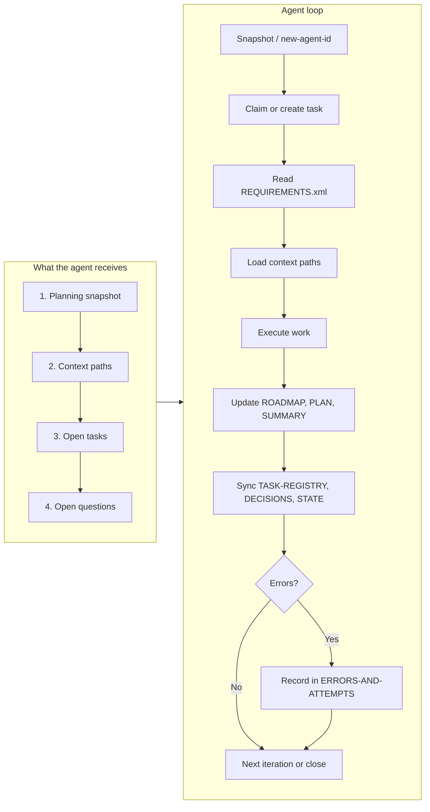
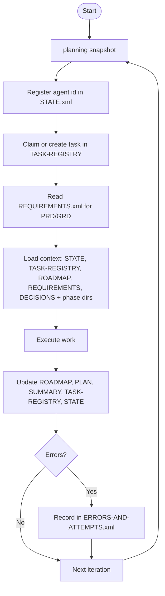

══════════════════════════════════════════════════════════════
  AGENT LOOP REPORT
══════════════════════════════════════════════════════════════

**Generated:** 2026-03-20T22:40:32.787Z  
**Format:** planning-agent-context/1.0

<details>
<summary><strong>KPIs — token usage, context per sprint phase</strong></summary>

Same as CLI: <code>planning kpis</code>

```text
PRD / REQUIREMENTS.xml
Total chars: 225644 · tokens ≈ 56417

Sprint 6 (phases: 46, 47, 48, 49, 50)
Task count: 24 · task-text tokens ≈ 1384
Context tokens per phase (phase dirs):

46 (46-human-playable-input-ux): ≈ 38730 tokens (154917 chars)
47 (47-agent-standalone-parity-hardening): ≈ 299 tokens (1193 chars)
48 (48-release-ready-text-graphics-polish): ≈ 245 tokens (980 chars)
49 (49-dungeon-explorer-spatial-viz): ≈ 915 tokens (3660 chars)
50 (50-ai-integration-assistant-ui-codex-app-server): ≈ 12334 tokens (49335 chars)

Sprint total (phase dirs + task text): ≈ 53907 tokens
```
</details>

<details>
<summary><strong>What is an agent’s workflow? (summary)</strong></summary>

1. **Snapshot** → `planning snapshot` (or `new-agent-id`) shows current phase, plan, agents, open tasks, phase progress.
2. **Get an ID** → `planning new-agent-id` prints a new id on one line (e.g. `agent-20250303-abcd`). The agent registers it in STATE.xml under `agent-registry`.
3. **Claim work** → Claim or create a task in TASK-REGISTRY.xml (phase, goal, commands).
4. **Read context** → When using the CLI (`planning simulate loop`), the bundle **serves** STATE, TASK-REGISTRY, ROADMAP, DECISIONS, and sprint phase dirs (and **always serves coding conventions**, e.g. AGENTS.md). The agent is also directed to **code file references** (from task commands + config) for implementation context.
5. **Execute** → Do the task; update ROADMAP, phase PLAN/SUMMARY; sync TASK-REGISTRY, DECISIONS, STATE.
6. **Errors** → Record in ERRORS-AND-ATTEMPTS.xml if needed.

**Outputs / references:** STATE.xml, TASK-REGISTRY.xml, ROADMAP.xml, REQUIREMENTS.xml, DECISIONS.xml, `.planning/phases/<phase>/` (PLAN.xml, SUMMARY.xml), `.planning/reports/` (this report).
</details>

<details>
<summary><strong>System health — track &amp; analyze</strong></summary>

Current snapshot (also in <code>.planning/reports/metrics.jsonl</code>; one line per <code>planning report generate</code>). Use <code>planning metrics</code> / <code>planning metrics-history --n 30</code> or fetch <code>http://localhost:3847/metrics?tail=50</code> when report server is running.

| Metric | Value |
|--------|-------|
| At | 2026-03-20T22:40:32.870Z |
| Tasks | 92 / 127 (72% done) |
| Open questions | 17 |
| Active agents | 5 |
| Phases (with tasks / total / complete) | 18 / 48 / 24 |
| Errors/attempts (ERRORS-AND-ATTEMPTS.xml) | 8 |
| Review (phases at 0% / unassigned / only planned) | 11 / 30 / 13 |
| Snapshot tokens (approx) | 3498 |
| Bundle tokens (simulate loop, approx) | 119499 |
</details>

<details>
<summary><strong>THINGS TO REVIEW</strong></summary>

Same as CLI: <code>planning review</code>

```text
Phases at 0% progress (e.g. 46: 0/1, 49: 0/1) or unassigned tasks may be skipped or abandoned. Use planning review to list them; planning review --json to output data for tools or APIs.

Phases at 0% (skipped/abandoned?)

Phase	Title	Tasks	Suggestion
49	Dungeon Explorer spatial visualization	49-01, 49-02	Phase may be skipped or abandoned; consider assigning work or closing/superseding tasks.
52	Unreal DLC content delivery pipeline and plugin integration	52-01, 52-02, 52-03, 52-04	Phase may be skipped or abandoned; consider assigning work or closing/superseding tasks.
53	Dolt lineage and authoring governance workflow	53-01	Phase may be skipped or abandoned; consider assigning work or closing/superseding tasks.
54	RepoPlanner submodule and host integration	54-01, 54-02	Phase may be skipped or abandoned; consider assigning work or closing/superseding tasks.
56	Content tools – entity archetype explorer	56-01	Phase may be skipped or abandoned; consider assigning work or closing/superseding tasks.
57	Content tools – spell and rune explorer	57-01, 57-02	Phase may be skipped or abandoned; consider assigning work or closing/superseding tasks.
58	Content tools – dialogue explorer	58-01, 58-02	Phase may be skipped or abandoned; consider assigning work or closing/superseding tasks.
59	Content tools – dungeon and room explorer	59-01	Phase may be skipped or abandoned; consider assigning work or closing/superseding tasks.
60	Content tools – spawn table viewer	60-01	Phase may be skipped or abandoned; consider assigning work or closing/superseding tasks.
61	Content tools – action catalog and intents viewer	61-01	Phase may be skipped or abandoned; consider assigning work or closing/superseding tasks.
63	Post-Initial-Development Content Editor Productization	63-01, 63-02, 63-03, 63-04, 63-05	Phase may be skipped or abandoned; consider assigning work or closing/superseding tasks.

Unassigned tasks (agent-## or empty)

Task	Phase	Status	Suggestion
49-01	49	planned	Task has no real agent assigned; assign or use agent-## as placeholder until claimed.
49-02	49	planned	Task has no real agent assigned; assign or use agent-## as placeholder until claimed.
50-12	50	planned	Task has no real agent assigned; assign or use agent-## as placeholder until claimed.
51-03	51	planned	Task has no real agent assigned; assign or use agent-## as placeholder until claimed.
51-37	51	planned	Task has no real agent assigned; assign or use agent-## as placeholder until claimed.
51-38	51	planned	Task has no real agent assigned; assign or use agent-## as placeholder until claimed.
51-40	51	planned	Task has no real agent assigned; assign or use agent-## as placeholder until claimed.
51-48	51	deferred	Task has no real agent assigned; assign or use agent-## as placeholder until claimed.
52-01	52	planned	Task has no real agent assigned; assign or use agent-## as placeholder until claimed.
52-02	52	planned	Task has no real agent assigned; assign or use agent-## as placeholder until claimed.
52-03	52	planned	Task has no real agent assigned; assign or use agent-## as placeholder until claimed.
52-04	52	planned	Task has no real agent assigned; assign or use agent-## as placeholder until claimed.
53-01	53	planned	Task has no real agent assigned; assign or use agent-## as placeholder until claimed.
54-01	54	planned	Task has no real agent assigned; assign or use agent-## as placeholder until claimed.
54-02	54	planned	Task has no real agent assigned; assign or use agent-## as placeholder until claimed.
55-01	55	planned	Task has no real agent assigned; assign or use agent-## as placeholder until claimed.
55-03	55	planned	Task has no real agent assigned; assign or use agent-## as placeholder until claimed.
56-01	56	planned	Task has no real agent assigned; assign or use agent-## as placeholder until claimed.
57-01	57	planned	Task has no real agent assigned; assign or use agent-## as placeholder until claimed.
57-02	57	planned	Task has no real agent assigned; assign or use agent-## as placeholder until claimed.
58-01	58	planned	Task has no real agent assigned; assign or use agent-## as placeholder until claimed.
58-02	58	planned	Task has no real agent assigned; assign or use agent-## as placeholder until claimed.
59-01	59	planned	Task has no real agent assigned; assign or use agent-## as placeholder until claimed.
60-01	60	planned	Task has no real agent assigned; assign or use agent-## as placeholder until claimed.
61-01	61	planned	Task has no real agent assigned; assign or use agent-## as placeholder until claimed.
… and 5 more (use --json for full list)

Phases with only planned work (no in-progress)

Phase	Title	Tasks	Suggestion
49	Dungeon Explorer spatial visualization	49-01, 49-02	No task in progress; may need prioritization or an agent to claim work.
50	AI integration architecture and schema-authoring workflows	50-12	No task in progress; may need prioritization or an agent to claim work.
52	Unreal DLC content delivery pipeline and plugin integration	52-01, 52-02, 52-03, 52-04	No task in progress; may need prioritization or an agent to claim work.
53	Dolt lineage and authoring governance workflow	53-01	No task in progress; may need prioritization or an agent to claim work.
54	RepoPlanner submodule and host integration	54-01, 54-02	No task in progress; may need prioritization or an agent to claim work.
55	Node module dependency analysis (greenfield / brownfield)	55-01, 55-03	No task in progress; may need prioritization or an agent to claim work.
56	Content tools – entity archetype explorer	56-01	No task in progress; may need prioritization or an agent to claim work.
57	Content tools – spell and rune explorer	57-01, 57-02	No task in progress; may need prioritization or an agent to claim work.
58	Content tools – dialogue explorer	58-01, 58-02	No task in progress; may need prioritization or an agent to claim work.
59	Content tools – dungeon and room explorer	59-01	No task in progress; may need prioritization or an agent to claim work.
60	Content tools – spawn table viewer	60-01	No task in progress; may need prioritization or an agent to claim work.
61	Content tools – action catalog and intents viewer	61-01	No task in progress; may need prioritization or an agent to claim work.
63	Post-Initial-Development Content Editor Productization	63-01, 63-02, 63-03, 63-04, 63-05	No task in progress; may need prioritization or an agent to claim work.
```
</details>


──────────────────────────────────────────────────────────────
  AGENT ID: what the agent sees (verbatim)
──────────────────────────────────────────────────────────────

When an agent runs **`planning new-agent-id`**, it receives exactly the following. (First: full snapshot. Then: one line with the new id.)

**1. Snapshot (exact stdout):**

```text
BEHAVIOR (AGENTS.md)

# Agent Loop Guide

XML-first planning. Use `.planning/templates/` for PLAN, SUMMARY, ROADMAP, TASK-REGISTRY, DECISIONS. Cite PRD/GRD in `references`.

**Quick start:** We have a planning CLI—run it to start. Run `planning snapshot` (or `pnpm planning snapshot` / `node scripts/loop-cli.mjs snapshot`) → register agent id in STATE.xml → claim task in TASK-REGISTRY.xml → read REQUIREMENTS.xml for phase. **When the planning MCP server (dungeonbreak-planning) is available,** prefer its tools (snapshot, open_questions, get_agent_bundle, task_update, etc.) so all agents use the same orchestration surface. **Workflow:** Update ROADMAP, phase PLAN/SUMMARY; sync TASK-REGISTRY, DECISIONS, STATE; add `requriements-suggestions` for gaps; record errors in ERRORS-AND-ATTEMPTS.xml. **Identity:** Unique `agent-YYYYMMDD-xxxx` in STATE; `planning new-agent-id`. **Loop:** Include snapshot in updates when asked; close tasks and set inactive when done; compact refs; don’t block on open questions—capture in `requriements-suggestions`.

---

# Coding Standards &amp; Styling

**Format &amp; lint:** `pnpm dlx ultracite fix` / `ultracite check`. Biome handles most formatting; run before commit.

**TypeScript:** Explicit types where they help; `unknown` over `any`; const assertions; type narrowing over assertions; named constants over magic numbers. **Null safety:** Narrow before use. Prefer optional chaining and `??`; in branches where you already checked (e.g. `if (x?.y?.length &gt; 0)`), use a single non-null assertion only when the type doesn&#39;t narrow (e.g. `x!.y`). Prefer `(value: string | null) =&gt; { if (value !== null) ... }` for callbacks that may receive null (e.g. Select `onValueChange`). **Component props:** Use only variants/sizes defined on the component (e.g. Button: `default` | `outline` | `ghost`; no `variant=&#34;link&#34;` or `size=&#34;icon-sm&#34;` unless added). Use Radix/shadcn patterns: `asChild` + child component instead of non-existent `render` props. **Next.js 15:** Wrap any component that uses `useSearchParams()` in a `&lt;Suspense&gt;` boundary when it&#39;s used on a page that can be statically generated.

**TS/JS:** Arrow callbacks; `for...of`; `?.` and `??`; template literals; destructuring; `const` by default.

**React:** Function components; hooks at top level only; full dependency arrays; unique `key` (not index); semantic HTML + ARIA (alt, headings, labels, keyboard + mouse, `&lt;button&gt;`/`&lt;nav&gt;`); no components defined inside components.

**DRY &amp; SOLID:** Don’t repeat yourself—extract shared logic and UI into reusable pieces. Single responsibility, open/closed, clear dependencies. Prefer composition over duplication.

**Components &amp; UI (don’t reinvent the wheel):** Use **shadcn/ui** first. Check the [shadcn registry](https://ui.shadcn.com) and 3rd party components built on shadcn (or Radix). Prefer lightweight, well-maintained 3rd party over custom builds. Only build custom when nothing fits.

**Icons:** Use icons for context—they’re reusable and condensed. Prefer a consistent icon set (e.g. Lucide, Radix Icons) over text labels or one-off SVGs. Use icons for actions, status, and navigation so UI stays scannable and DRY.

**UI aesthetic (senior stylist):** Emulate **PostHog-style dashboard** on **compact editor density** (Unreal/Unity-inspired). Goal: good-looking, organized UI.

- **PostHog traits:** Vibrant purple primary (#5B21B6 → #A78BFA gradient); white/near-white cards (bg-white/95 dark:bg-slate-900/80); sharp shadows (shadow-md hover:shadow-xl); bold typography (font-semibold text-base+); metric cards border-none with divider lines; charts with glassmorphism overlays.
- **Core tokens:** primary purple-500/600 (#A78BFA/#7C3AED), accent indigo-500, success green-500, bg-card white dark:slate-900/90.
- **Cards:** bg-card border-0 shadow-lg rounded-xl p-4–6 hover:shadow-2xl transition-all duration-200.
- **Typography:** text-foreground font-medium tracking-tight; text-lg for headers.
- **Metrics/Charts:** Full-width, border-t pt-4 after:border-muted/50, hover:scale-[1.02].
- **Buttons:** bg-gradient-to-r from-purple-500 to-indigo-600 hover:from-purple-600 text-white shadow-lg.
- **Layout:** Mobile stack; desktop grid-1 md:grid-cols-3 for dashboards. Extend theme (colors/shadows) in config, not one-off classes.

**When delivering UI changes:** Provide refactored TSX, config diff (colors/shadows), checklist, and **PostHog vibe score (High/Med/Low)** so we keep the aesthetic consistent.

**Styling (general):** Design tokens over magic colors; semantic class names; co-located or clear structure; Next.js `&lt;Image&gt;` where applicable.

**Errors &amp; flow:** Early returns over deep nesting; throw `Error` with clear messages; remove `console.log`/`debugger` from commits. Avoid build-breaking type errors: narrow null/undefined before use; type callback params (e.g. `string | null` for Select); use only existing component variant/size values; wrap `useSearchParams()` usage in Suspense.

**Security:** `rel=&#34;noopener&#34;` with `target=&#34;_blank&#34;`; avoid `dangerouslySetInnerHTML` unless required; no `eval()`.

**Perf:** Prefer **O(1)** or **O(n log n)** over O(n) or worse; only use higher complexity when unavoidable and document why. No spread in loop accumulators; top-level regex; specific imports; proper image components. Use sets/maps for lookups; avoid repeated linear scans; sort once if needed (n log n) rather than repeated O(n) passes.

**Tests:** Assert inside `it()`/`test()`; async/await not done callbacks; no `.only`/`.skip` in repo.

Consider these when editing; run `pnpm dlx ultracite fix` before committing.


────────────────────────────────────────

STATE (.planning/STATE.xml)
agents (active):
  agent-20260312-s5ar  phase=46 plan=46-01  0/1 (0%)
    task 46-01 [in-progress] Make Escape the Dungeon personally playable in standalone KA…
  agent-20260314-ghjz  phase=46 plan=46-04  1/2 (50%)
    task 46-04 [in-progress] Use the new boot flow as the baseline for a room-loop cleanu…
  agent-20260318-428f  phase=62 plan=62-03  6/8 (75%)
    task 62-02 [in-progress] Decompose `game.ts` into dedicated engine seams by first mov…
    task 62-03 [in-progress] Extract event, progression, and history systems out of `game…
  agent-20260320-g41m  phase=62 plan=62-05  2/2 (100%)
  agent-20260320-qolj  phase=46 plan=46-10  3/4 (75%)
    task 46-10 [in-progress] Converge runtime resources and progression with the gameplay…

OPEN TASKS (.planning/TASK-REGISTRY.xml)
  46-01 [in-progress] Make Escape the Dungeon personally playable in standalone KAPLAY by rebuilding the game around clear menus, real inputs, onboarding, readable combat/dialogue/cutscene presentation, and schema-driven visual content. (agent: agent-20260312-s5ar)
  46-04 [in-progress] Use the new boot flow as the baseline for a room-loop cleanup: simplify command taxonomy, align gameplay and display UI with the gameplay design, add the first persistent gameplay HUD and content-driven mount traversal affordance, and keep both the main menu and authored room path feeling intentional instead of debug-like. (agent: agent-20260314-ghjz)
  46-10 [in-progress] Converge runtime resources and progression with the gameplay design by replacing remaining energy bridges with mana/crystal flow, tightening spell-runtime convergence, and finishing summon/title/entity integration follow-through. (agent: agent-20260320-qolj)
  49-01 [planned] Dungeon Explorer spatial visualization plan + layout payload. (agent: agent-##)
  49-02 [planned] Plan the room-by-room dungeon presentation around the local 16x16 dungeon tileset, keeping authored room/layout payloads simple enough for both KAPLAY and the Unreal plugin pipeline to consume. (agent: agent-##)
  50-12 [planned] Run end-to-end chat-authoring verification in Space Explorer and finalize release readiness checks for this phase. (agent: agent-##)
  51-03 [planned] Define Supabase/S3 pull/push contracts for content-pack bundles and reports, including indexing/versioning and upload provenance. (agent: agent-##)
  51-37 [planned] Continue extracting Content Creator tree/json schema/editor logic from space-explorer.tsx into reusable hooks, utilities, and shell components. (agent: agent-##)
  51-38 [planned] Add stat-modifier mapping editor in stats info panel and wire live updates into runtime model schema overrides. (agent: agent-##)
  51-40 [planned] Continue Space Explorer decomposition: fix runtime-space-plot UTF-8 compile error and keep extracting pack/report loading + state plumbing from space-explorer.tsx (agent: agent-##)
  51-48 [deferred] Deferred out of the current game-development lane. Validation runs, diff-aware publish gating, and richer edit flows move to the post-initial-development content-editor productization phase. (agent: agent-##)
  52-01 [planned] Define Unreal DLC delivery phase baseline: add DB_Unreal_DLC_Plugin submodule and create implementation plan for downloadable packs, ingestion contracts, schema/asset alignment, and secret handling. (agent: agent-##)
  52-02 [planned] Define Supabase/S3 delivery contract and implement encrypted env bundle workflow for docs-site + Unreal plugin cross-repo operations. (agent: agent-##)
  52-03 [planned] Implement content pack publish/pull API contract with versioned manifest index and signed Supabase download URLs. (agent: agent-##)
  52-04 [planned] Document end-to-end content delivery workflow in docs-site (Content Editor, Supabase distribution, Unreal plugin consumption, Dolt lineage role), including audience and expectations. (agent: agent-##)
  53-01 [planned] Define Dolt authoring lineage workflow contract: branch strategy, merge gates, release promotion semantics, and ownership model. (agent: agent-##)
  54-01 [planned] RepoPlanner at vendor/repo-planner: add submodule, pull remote, document simple Next.js component + theme/Codex/loop integration; migrate planning code into submodule and push. (agent: agent-##)
  54-02 [planned] Package owns all planning API surface: move routes/handlers into vendor/repo-planner; add install-routes script so host can install API routes from package; standalone mode with project-folder selection; atomic design (atoms/molecules/organisms) + STYLING in package. (agent: agent-##)
  55-01 [planned] Build dependency usage analysis pipeline: static + dynamic require; product usage only (exclude test-only); machine-readable output for REQUIREMENTS.xml and phase plans. No specific dep yet—user picks after analysis ready. (agent: agent-##)
  55-03 [planned] Dependencies tab in planning cockpit: rich UI and coloring (usage table, replaceability badges green/amber/red, package → exports hierarchy). Consume analysis API from 55-01; use PanelSection, status helpers, compact tables. (agent: agent-##)
  62-02 [in-progress] Decompose `game.ts` into dedicated engine seams by first moving canonical entity stats and entity factories out of the file, then extracting navigation, social, combat, inventory, and rune-forge action families with parity tests and a cleaner runtime `narrativeStatDelta` boundary. (agent: agent-20260318-428f)
  62-03 [in-progress] Extract event, progression, and history systems out of `game.ts` and leave `GameEngine` as orchestration only. (agent: agent-20260318-428f)
  63-01 [planned] Rename the editor-side `platform`/extension surface to `project data` across collections, routes, UI, docs, and planning so the authoring model matches the real system language. (agent: agent-##)
  63-02 [planned] Harden auth for DB-backed authoring while preserving auto-login ergonomics in development for the docs-site admin and content-editor workflow. (agent: agent-##)
  63-03 [planned] Add validation runs, diff-aware publish gating, and review receipts so project content changes are checked before they write back into engine/game files. (agent: agent-##)
  63-04 [planned] Implement schema-driven content-editor forms using `react-jsonschema-form` for authored pack and project-data schemas instead of building a custom schema-form system. (agent: agent-##)
  63-05 [planned] Add richer post-initial-development editor flows: edit/delete for project data and custom schemas, asset binding workflows, and higher-level project management UX on top of the schema-form foundation. (agent: agent-##)

PHASE
  Progress (.planning/TASK-REGISTRY.xml)
    44: 26/26 (100%)
    45: 1/1 (100%)
    46: 7/10 (70%)
    49: 0/2 (0%)  review?
    50: 11/12 (92%)
    51: 43/48 (90%)
    52: 0/4 (0%)  review?
    53: 0/1 (0%)  review?
    54: 0/2 (0%)  review?
    55: 1/3 (33%)
    62: 3/5 (60%)
    63: 0/5 (0%)  review?

  NEEDS REVIEW
    49, 52, 53, 54, 63
  DEPS (tree, id title [status]) (.planning/ROADMAP.xml) — file context
    46 Human-playable game UX harde [active]
      └ 47 Agent-play and standalone pa [plan]
        └ 48 Release-ready text-graphics  [plan]
    49 Dungeon Explorer spatial vis [active]
      └ 50 AI integration architecture  [active]

  Similar phases  (phase↔phase similarity%  files touched)
    46↔47 69%  packages/engine, scripts/build-content-pack-bundle.mjs, scripts/generate-contract-source-assets.mjs, contracts/data, contracts/index.ts, contracts/schemas
    46↔48 55%  packages/engine, scripts/build-content-pack-bundle.mjs, scripts/generate-contract-source-assets.mjs, contracts/data, contracts/index.ts, contracts/schemas
    46↔49 74%  packages/engine, scripts/build-content-pack-bundle.mjs, scripts/generate-contract-source-assets.mjs, contracts/data, contracts/index.ts, contracts/schemas
    46↔50 62%  packages/engine, scripts/build-content-pack-bundle.mjs, scripts/generate-contract-source-assets.mjs, contracts/data, contracts/index.ts, contracts/schemas
    47↔48 67%  —
    47↔49 65%  packages/engine
    47↔50 68%  docs-site, reports/space-explorer.tsx, scripts/loop-cli.mjs
    48↔49 61%  packages/engine
    48↔50 63%  docs-site, reports/space-explorer.tsx, scripts/loop-cli.mjs
    49↔50 66%  packages/engine, docs-site, reports/space-explorer.tsx, scripts/loop-cli.mjs
```

**2. Then one line (exact stdout):**

```text
Your new agent id: agent-20260320-repr
```

The agent adds the printed id to STATE.xml under `agent-registry` (and optionally sets phase, plan, status). **Who’s working** = agents that have claimed an id (listed in STATE.xml). Below: count and list of those agents and the **context** (task goals, phase titles) they see.


──────────────────────────────────────────────────────────────
  AGENTS IN THE REPO (5 with claimed IDs)
──────────────────────────────────────────────────────────────


- **agent-20260312-s5ar** — name:  | phase: 46 | plan: 46-01 | status: in-progress
  <details>
  <summary>Tasks &amp; context (what this agent reads)</summary>
  
  | Task | Status | Goal | Phase |
  |------|--------|------|-------|
  | 46-01 | in-progress | Make Escape the Dungeon personally playable in standalone KAPLAY by rebuilding the game around clear menus, real inputs, onboarding, readable combat/dialogue/cutscene presentation, and schema-driven visual content. | 46 (Human-playable game UX hardening) |
  
  
  </details>

- **agent-20260314-ghjz** — name:  | phase: 46 | plan: 46-04 | status: in-progress
  <details>
  <summary>Tasks &amp; context (what this agent reads)</summary>
  
  | Task | Status | Goal | Phase |
  |------|--------|------|-------|
  | 46-04 | in-progress | Use the new boot flow as the baseline for a room-loop cleanup: simplify command taxonomy, align gameplay and display UI with the gameplay design, add the first persistent gameplay HUD and content-driven mount traversal affordance, and keep both the main menu and authored room path feeling intentional instead of debug-like. | 46 (Human-playable game UX hardening) |
  | 46-05 | done | Review gameplay design, authored data packs, schema coverage, content-source inclusion, and runtime exports together so the next implementation slices are aligned to the real game loop. | 46 (Human-playable game UX hardening) |
  
  
  </details>

- **agent-20260318-428f** — name:  | phase: 62 | plan: 62-03 | status: in-progress
  <details>
  <summary>Tasks &amp; context (what this agent reads)</summary>
  
  | Task | Status | Goal | Phase |
  |------|--------|------|-------|
  | 51-44 | done | Add a contract-backed content pack registry and editor metadata layer so docs-site and future Payload-backed CRUD surfaces consume canonical engine pack definitions instead of ad hoc filesystem scans or duplicated pack lists. | 51 (Content schema file test-mode authoring loop) |
  | 51-45 | done | Implement the first Payload-backed content authoring vertical slice: project records, canonical schema/pack import into Payload, project export files, generated Payload types/migration, and a docs-site content-app workspace that drives the flow. | 51 (Content schema file test-mode authoring loop) |
  | 51-46 | done | Harden the Payload authoring loop with custom-schema/platform collections, publish-back-to-engine and KAPLAY refresh flow, applied DB migrations, and a bootstrap command that seeds/imports canonical game pack data into Payload. | 51 (Content schema file test-mode authoring loop) |
  | 51-47 | done | Build per-pack CRUD editing, browser authoring flows for custom schemas and docs-site platform extensions, revision history, and publish-job receipts on top of the working Payload import/export/publish backbone. | 51 (Content schema file test-mode authoring loop) |
  | 62-01 | done | Define the `game.ts` extraction map and pull pure helpers/bootstrap/status serialization into dedicated engine modules without changing runtime behavior. | 62 (Engine runtime decomposition and module extraction) |
  | 62-02 | in-progress | Decompose `game.ts` into dedicated engine seams by first moving canonical entity stats and entity factories out of the file, then extracting navigation, social, combat, inventory, and rune-forge action families with parity tests and a cleaner runtime `narrativeStatDelta` boundary. | 62 (Engine runtime decomposition and module extraction) |
  | 62-03 | in-progress | Extract event, progression, and history systems out of `game.ts` and leave `GameEngine` as orchestration only. | 62 (Engine runtime decomposition and module extraction) |
  | 62-04 | done | Normalize remaining engine/runtime vocabulary from trait/feature split terms to stat-domain naming where the runtime owns the surface, and add generated collection accessor/record exports so gameplay code consumes content packs through convenient typed lookups instead of repeated local maps. | 62 (Engine runtime decomposition and module extraction) |
  
  
  </details>

- **agent-20260320-g41m** — name:  | phase: 62 | plan: 62-05 | status: done
  <details>
  <summary>Tasks &amp; context (what this agent reads)</summary>
  
  | Task | Status | Goal | Phase |
  |------|--------|------|-------|
  | 46-06 | done | Close contract drift by adding/fixing missing gameplay pack schemas, reconciling schema docs with actual coverage, and exporting the remaining authored packs the runtime/UI need as first-class contracts. | 46 (Human-playable game UX hardening) |
  | 62-05 | done | Generate canonical content-pack registry artifacts instead of hand-maintaining registry rows in `contracts/index.ts`, remove non-canonical runtime-only pack concepts from the editorial registry, and fold presenter/feed strings into the dialogue pack. | 62 (Engine runtime decomposition and module extraction) |
  
  
  </details>

- **agent-20260320-qolj** — name:  | phase: 46 | plan: 46-10 | status: in-progress
  <details>
  <summary>Tasks &amp; context (what this agent reads)</summary>
  
  | Task | Status | Goal | Phase |
  |------|--------|------|-------|
  | 46-07 | done | Implement the loot/search economy pillar: treasure chests, combat crystal rewards, map-item and dark-map handling, and authored reward/sell behavior wired into the current room loop. | 46 (Human-playable game UX hardening) |
  | 46-08 | done | Implement the dungeon pressure pillar: dungeon tick cadence, boss spawn schedule, hostility decay, spawn warnings, and HUD support for time pressure. | 46 (Human-playable game UX hardening) |
  | 46-09 | done | Implement the authored interaction pillar: room-entry events, cutscenes, flat dialogue-option scene flow, and stronger entity-model bindings for NPCs and encounters. | 46 (Human-playable game UX hardening) |
  | 46-10 | in-progress | Converge runtime resources and progression with the gameplay design by replacing remaining energy bridges with mana/crystal flow, tightening spell-runtime convergence, and finishing summon/title/entity integration follow-through. | 46 (Human-playable game UX hardening) |
  
  
  </details>


──────────────────────────────────────────────────────────────
  WHAT THE AGENT SEES (literal inputs in workflow order)
──────────────────────────────────────────────────────────────

Exact CLI/bundle output the agent receives; each input is in a code block below.

**Current (focal):** STATE has a single **current-phase** and **current-plan** — the repo’s chosen focus (e.g. phase 50, plan 50-09). That is “who is current” at the repo level. **Phases with in-progress work** can be several: any phase that has an agent with status `in-progress` or a task with status `in-progress`. Right now: 46, 62.

**1. SNAPSHOT (exact stdout of planning snapshot / new-agent-id)**

```text
BEHAVIOR (AGENTS.md)

# Agent Loop Guide

XML-first planning. Use `.planning/templates/` for PLAN, SUMMARY, ROADMAP, TASK-REGISTRY, DECISIONS. Cite PRD/GRD in `references`.

**Quick start:** We have a planning CLI—run it to start. Run `planning snapshot` (or `pnpm planning snapshot` / `node scripts/loop-cli.mjs snapshot`) → register agent id in STATE.xml → claim task in TASK-REGISTRY.xml → read REQUIREMENTS.xml for phase. **When the planning MCP server (dungeonbreak-planning) is available,** prefer its tools (snapshot, open_questions, get_agent_bundle, task_update, etc.) so all agents use the same orchestration surface. **Workflow:** Update ROADMAP, phase PLAN/SUMMARY; sync TASK-REGISTRY, DECISIONS, STATE; add `requriements-suggestions` for gaps; record errors in ERRORS-AND-ATTEMPTS.xml. **Identity:** Unique `agent-YYYYMMDD-xxxx` in STATE; `planning new-agent-id`. **Loop:** Include snapshot in updates when asked; close tasks and set inactive when done; compact refs; don’t block on open questions—capture in `requriements-suggestions`.

---

# Coding Standards &amp; Styling

**Format &amp; lint:** `pnpm dlx ultracite fix` / `ultracite check`. Biome handles most formatting; run before commit.

**TypeScript:** Explicit types where they help; `unknown` over `any`; const assertions; type narrowing over assertions; named constants over magic numbers. **Null safety:** Narrow before use. Prefer optional chaining and `??`; in branches where you already checked (e.g. `if (x?.y?.length &gt; 0)`), use a single non-null assertion only when the type doesn&#39;t narrow (e.g. `x!.y`). Prefer `(value: string | null) =&gt; { if (value !== null) ... }` for callbacks that may receive null (e.g. Select `onValueChange`). **Component props:** Use only variants/sizes defined on the component (e.g. Button: `default` | `outline` | `ghost`; no `variant=&#34;link&#34;` or `size=&#34;icon-sm&#34;` unless added). Use Radix/shadcn patterns: `asChild` + child component instead of non-existent `render` props. **Next.js 15:** Wrap any component that uses `useSearchParams()` in a `&lt;Suspense&gt;` boundary when it&#39;s used on a page that can be statically generated.

**TS/JS:** Arrow callbacks; `for...of`; `?.` and `??`; template literals; destructuring; `const` by default.

**React:** Function components; hooks at top level only; full dependency arrays; unique `key` (not index); semantic HTML + ARIA (alt, headings, labels, keyboard + mouse, `&lt;button&gt;`/`&lt;nav&gt;`); no components defined inside components.

**DRY &amp; SOLID:** Don’t repeat yourself—extract shared logic and UI into reusable pieces. Single responsibility, open/closed, clear dependencies. Prefer composition over duplication.

**Components &amp; UI (don’t reinvent the wheel):** Use **shadcn/ui** first. Check the [shadcn registry](https://ui.shadcn.com) and 3rd party components built on shadcn (or Radix). Prefer lightweight, well-maintained 3rd party over custom builds. Only build custom when nothing fits.

**Icons:** Use icons for context—they’re reusable and condensed. Prefer a consistent icon set (e.g. Lucide, Radix Icons) over text labels or one-off SVGs. Use icons for actions, status, and navigation so UI stays scannable and DRY.

**UI aesthetic (senior stylist):** Emulate **PostHog-style dashboard** on **compact editor density** (Unreal/Unity-inspired). Goal: good-looking, organized UI.

- **PostHog traits:** Vibrant purple primary (#5B21B6 → #A78BFA gradient); white/near-white cards (bg-white/95 dark:bg-slate-900/80); sharp shadows (shadow-md hover:shadow-xl); bold typography (font-semibold text-base+); metric cards border-none with divider lines; charts with glassmorphism overlays.
- **Core tokens:** primary purple-500/600 (#A78BFA/#7C3AED), accent indigo-500, success green-500, bg-card white dark:slate-900/90.
- **Cards:** bg-card border-0 shadow-lg rounded-xl p-4–6 hover:shadow-2xl transition-all duration-200.
- **Typography:** text-foreground font-medium tracking-tight; text-lg for headers.
- **Metrics/Charts:** Full-width, border-t pt-4 after:border-muted/50, hover:scale-[1.02].
- **Buttons:** bg-gradient-to-r from-purple-500 to-indigo-600 hover:from-purple-600 text-white shadow-lg.
- **Layout:** Mobile stack; desktop grid-1 md:grid-cols-3 for dashboards. Extend theme (colors/shadows) in config, not one-off classes.

**When delivering UI changes:** Provide refactored TSX, config diff (colors/shadows), checklist, and **PostHog vibe score (High/Med/Low)** so we keep the aesthetic consistent.

**Styling (general):** Design tokens over magic colors; semantic class names; co-located or clear structure; Next.js `&lt;Image&gt;` where applicable.

**Errors &amp; flow:** Early returns over deep nesting; throw `Error` with clear messages; remove `console.log`/`debugger` from commits. Avoid build-breaking type errors: narrow null/undefined before use; type callback params (e.g. `string | null` for Select); use only existing component variant/size values; wrap `useSearchParams()` usage in Suspense.

**Security:** `rel=&#34;noopener&#34;` with `target=&#34;_blank&#34;`; avoid `dangerouslySetInnerHTML` unless required; no `eval()`.

**Perf:** Prefer **O(1)** or **O(n log n)** over O(n) or worse; only use higher complexity when unavoidable and document why. No spread in loop accumulators; top-level regex; specific imports; proper image components. Use sets/maps for lookups; avoid repeated linear scans; sort once if needed (n log n) rather than repeated O(n) passes.

**Tests:** Assert inside `it()`/`test()`; async/await not done callbacks; no `.only`/`.skip` in repo.

Consider these when editing; run `pnpm dlx ultracite fix` before committing.


────────────────────────────────────────

STATE (.planning/STATE.xml)
agents (active):
  agent-20260312-s5ar  phase=46 plan=46-01  0/1 (0%)
    task 46-01 [in-progress] Make Escape the Dungeon personally playable in standalone KA…
  agent-20260314-ghjz  phase=46 plan=46-04  1/2 (50%)
    task 46-04 [in-progress] Use the new boot flow as the baseline for a room-loop cleanu…
  agent-20260318-428f  phase=62 plan=62-03  6/8 (75%)
    task 62-02 [in-progress] Decompose `game.ts` into dedicated engine seams by first mov…
    task 62-03 [in-progress] Extract event, progression, and history systems out of `game…
  agent-20260320-g41m  phase=62 plan=62-05  2/2 (100%)
  agent-20260320-qolj  phase=46 plan=46-10  3/4 (75%)
    task 46-10 [in-progress] Converge runtime resources and progression with the gameplay…

OPEN TASKS (.planning/TASK-REGISTRY.xml)
  46-01 [in-progress] Make Escape the Dungeon personally playable in standalone KAPLAY by rebuilding the game around clear menus, real inputs, onboarding, readable combat/dialogue/cutscene presentation, and schema-driven visual content. (agent: agent-20260312-s5ar)
  46-04 [in-progress] Use the new boot flow as the baseline for a room-loop cleanup: simplify command taxonomy, align gameplay and display UI with the gameplay design, add the first persistent gameplay HUD and content-driven mount traversal affordance, and keep both the main menu and authored room path feeling intentional instead of debug-like. (agent: agent-20260314-ghjz)
  46-10 [in-progress] Converge runtime resources and progression with the gameplay design by replacing remaining energy bridges with mana/crystal flow, tightening spell-runtime convergence, and finishing summon/title/entity integration follow-through. (agent: agent-20260320-qolj)
  49-01 [planned] Dungeon Explorer spatial visualization plan + layout payload. (agent: agent-##)
  49-02 [planned] Plan the room-by-room dungeon presentation around the local 16x16 dungeon tileset, keeping authored room/layout payloads simple enough for both KAPLAY and the Unreal plugin pipeline to consume. (agent: agent-##)
  50-12 [planned] Run end-to-end chat-authoring verification in Space Explorer and finalize release readiness checks for this phase. (agent: agent-##)
  51-03 [planned] Define Supabase/S3 pull/push contracts for content-pack bundles and reports, including indexing/versioning and upload provenance. (agent: agent-##)
  51-37 [planned] Continue extracting Content Creator tree/json schema/editor logic from space-explorer.tsx into reusable hooks, utilities, and shell components. (agent: agent-##)
  51-38 [planned] Add stat-modifier mapping editor in stats info panel and wire live updates into runtime model schema overrides. (agent: agent-##)
  51-40 [planned] Continue Space Explorer decomposition: fix runtime-space-plot UTF-8 compile error and keep extracting pack/report loading + state plumbing from space-explorer.tsx (agent: agent-##)
  51-48 [deferred] Deferred out of the current game-development lane. Validation runs, diff-aware publish gating, and richer edit flows move to the post-initial-development content-editor productization phase. (agent: agent-##)
  52-01 [planned] Define Unreal DLC delivery phase baseline: add DB_Unreal_DLC_Plugin submodule and create implementation plan for downloadable packs, ingestion contracts, schema/asset alignment, and secret handling. (agent: agent-##)
  52-02 [planned] Define Supabase/S3 delivery contract and implement encrypted env bundle workflow for docs-site + Unreal plugin cross-repo operations. (agent: agent-##)
  52-03 [planned] Implement content pack publish/pull API contract with versioned manifest index and signed Supabase download URLs. (agent: agent-##)
  52-04 [planned] Document end-to-end content delivery workflow in docs-site (Content Editor, Supabase distribution, Unreal plugin consumption, Dolt lineage role), including audience and expectations. (agent: agent-##)
  53-01 [planned] Define Dolt authoring lineage workflow contract: branch strategy, merge gates, release promotion semantics, and ownership model. (agent: agent-##)
  54-01 [planned] RepoPlanner at vendor/repo-planner: add submodule, pull remote, document simple Next.js component + theme/Codex/loop integration; migrate planning code into submodule and push. (agent: agent-##)
  54-02 [planned] Package owns all planning API surface: move routes/handlers into vendor/repo-planner; add install-routes script so host can install API routes from package; standalone mode with project-folder selection; atomic design (atoms/molecules/organisms) + STYLING in package. (agent: agent-##)
  55-01 [planned] Build dependency usage analysis pipeline: static + dynamic require; product usage only (exclude test-only); machine-readable output for REQUIREMENTS.xml and phase plans. No specific dep yet—user picks after analysis ready. (agent: agent-##)
  55-03 [planned] Dependencies tab in planning cockpit: rich UI and coloring (usage table, replaceability badges green/amber/red, package → exports hierarchy). Consume analysis API from 55-01; use PanelSection, status helpers, compact tables. (agent: agent-##)
  62-02 [in-progress] Decompose `game.ts` into dedicated engine seams by first moving canonical entity stats and entity factories out of the file, then extracting navigation, social, combat, inventory, and rune-forge action families with parity tests and a cleaner runtime `narrativeStatDelta` boundary. (agent: agent-20260318-428f)
  62-03 [in-progress] Extract event, progression, and history systems out of `game.ts` and leave `GameEngine` as orchestration only. (agent: agent-20260318-428f)
  63-01 [planned] Rename the editor-side `platform`/extension surface to `project data` across collections, routes, UI, docs, and planning so the authoring model matches the real system language. (agent: agent-##)
  63-02 [planned] Harden auth for DB-backed authoring while preserving auto-login ergonomics in development for the docs-site admin and content-editor workflow. (agent: agent-##)
  63-03 [planned] Add validation runs, diff-aware publish gating, and review receipts so project content changes are checked before they write back into engine/game files. (agent: agent-##)
  63-04 [planned] Implement schema-driven content-editor forms using `react-jsonschema-form` for authored pack and project-data schemas instead of building a custom schema-form system. (agent: agent-##)
  63-05 [planned] Add richer post-initial-development editor flows: edit/delete for project data and custom schemas, asset binding workflows, and higher-level project management UX on top of the schema-form foundation. (agent: agent-##)

PHASE
  Progress (.planning/TASK-REGISTRY.xml)
    44: 26/26 (100%)
    45: 1/1 (100%)
    46: 7/10 (70%)
    49: 0/2 (0%)  review?
    50: 11/12 (92%)
    51: 43/48 (90%)
    52: 0/4 (0%)  review?
    53: 0/1 (0%)  review?
    54: 0/2 (0%)  review?
    55: 1/3 (33%)
    62: 3/5 (60%)
    63: 0/5 (0%)  review?

  NEEDS REVIEW
    49, 52, 53, 54, 63
  DEPS (tree, id title [status]) (.planning/ROADMAP.xml) — file context
    46 Human-playable game UX harde [active]
      └ 47 Agent-play and standalone pa [plan]
        └ 48 Release-ready text-graphics  [plan]
    49 Dungeon Explorer spatial vis [active]
      └ 50 AI integration architecture  [active]

  Similar phases  (phase↔phase similarity%  files touched)
    46↔47 69%  packages/engine, scripts/build-content-pack-bundle.mjs, scripts/generate-contract-source-assets.mjs, contracts/data, contracts/index.ts, contracts/schemas
    46↔48 55%  packages/engine, scripts/build-content-pack-bundle.mjs, scripts/generate-contract-source-assets.mjs, contracts/data, contracts/index.ts, contracts/schemas
    46↔49 74%  packages/engine, scripts/build-content-pack-bundle.mjs, scripts/generate-contract-source-assets.mjs, contracts/data, contracts/index.ts, contracts/schemas
    46↔50 62%  packages/engine, scripts/build-content-pack-bundle.mjs, scripts/generate-contract-source-assets.mjs, contracts/data, contracts/index.ts, contracts/schemas
    47↔48 67%  —
    47↔49 65%  packages/engine
    47↔50 68%  docs-site, reports/space-explorer.tsx, scripts/loop-cli.mjs
    48↔49 61%  packages/engine
    48↔50 63%  docs-site, reports/space-explorer.tsx, scripts/loop-cli.mjs
    49↔50 66%  packages/engine, docs-site, reports/space-explorer.tsx, scripts/loop-cli.mjs
```

**2. NEW AGENT ID LINE (exact stdout when running planning new-agent-id)**

```text
Your new agent id: agent-20260320-repr
```

**3. CONTEXT PATHS (exact list from bundle, one per line)**

```text
.planning\STATE.xml
.planning\TASK-REGISTRY.xml
.planning\ROADMAP.xml
.planning\REQUIREMENTS.xml
.planning\DECISIONS.xml
.planning\phases\46-human-playable-input-ux
.planning\phases\47-agent-standalone-parity-hardening
.planning\phases\48-release-ready-text-graphics-polish
.planning\phases\49-dungeon-explorer-spatial-viz
.planning\phases\50-ai-integration-assistant-ui-codex-app-server
```

*In bundle:* conventions AGENTS.md · code refs 18 paths

**4. OPEN TASKS (exact format from snapshot/bundle)**

```text

- 46-01 [in-progress] Make Escape the Dungeon personally playable in standalone KAPLAY by rebuilding the game around clear menus, real inputs, onboarding, readable combat/dialogue/cutscene presentation, and schema-driven visual content. (agent: agent-20260312-s5ar)
- 46-04 [in-progress] Use the new boot flow as the baseline for a room-loop cleanup: simplify command taxonomy, align gameplay and display UI with the gameplay design, add the first persistent gameplay HUD and content-driven mount traversal affordance, and keep both the main menu and authored room path feeling intentional instead of debug-like. (agent: agent-20260314-ghjz)
- 46-10 [in-progress] Converge runtime resources and progression with the gameplay design by replacing remaining energy bridges with mana/crystal flow, tightening spell-runtime convergence, and finishing summon/title/entity integration follow-through. (agent: agent-20260320-qolj)
- 49-01 [planned] Dungeon Explorer spatial visualization plan + layout payload. (agent: agent-##)
- 49-02 [planned] Plan the room-by-room dungeon presentation around the local 16x16 dungeon tileset, keeping authored room/layout payloads simple enough for both KAPLAY and the Unreal plugin pipeline to consume. (agent: agent-##)
- 50-12 [planned] Run end-to-end chat-authoring verification in Space Explorer and finalize release readiness checks for this phase. (agent: agent-##)
- 51-03 [planned] Define Supabase/S3 pull/push contracts for content-pack bundles and reports, including indexing/versioning and upload provenance. (agent: agent-##)
- 51-37 [planned] Continue extracting Content Creator tree/json schema/editor logic from space-explorer.tsx into reusable hooks, utilities, and shell components. (agent: agent-##)
- 51-38 [planned] Add stat-modifier mapping editor in stats info panel and wire live updates into runtime model schema overrides. (agent: agent-##)
- 51-40 [planned] Continue Space Explorer decomposition: fix runtime-space-plot UTF-8 compile error and keep extracting pack/report loading + state plumbing from space-explorer.tsx (agent: agent-##)
- 51-48 [deferred] Deferred out of the current game-development lane. Validation runs, diff-aware publish gating, and richer edit flows move to the post-initial-development content-editor productization phase. (agent: agent-##)
- 52-01 [planned] Define Unreal DLC delivery phase baseline: add DB_Unreal_DLC_Plugin submodule and create implementation plan for downloadable packs, ingestion contracts, schema/asset alignment, and secret handling. (agent: agent-##)
- 52-02 [planned] Define Supabase/S3 delivery contract and implement encrypted env bundle workflow for docs-site + Unreal plugin cross-repo operations. (agent: agent-##)
- 52-03 [planned] Implement content pack publish/pull API contract with versioned manifest index and signed Supabase download URLs. (agent: agent-##)
- 52-04 [planned] Document end-to-end content delivery workflow in docs-site (Content Editor, Supabase distribution, Unreal plugin consumption, Dolt lineage role), including audience and expectations. (agent: agent-##)
- 53-01 [planned] Define Dolt authoring lineage workflow contract: branch strategy, merge gates, release promotion semantics, and ownership model. (agent: agent-##)
- 54-01 [planned] RepoPlanner at vendor/repo-planner: add submodule, pull remote, document simple Next.js component + theme/Codex/loop integration; migrate planning code into submodule and push. (agent: agent-##)
- 54-02 [planned] Package owns all planning API surface: move routes/handlers into vendor/repo-planner; add install-routes script so host can install API routes from package; standalone mode with project-folder selection; atomic design (atoms/molecules/organisms) + STYLING in package. (agent: agent-##)
- 55-01 [planned] Build dependency usage analysis pipeline: static + dynamic require; product usage only (exclude test-only); machine-readable output for REQUIREMENTS.xml and phase plans. No specific dep yet—user picks after analysis ready. (agent: agent-##)
- 55-03 [planned] Dependencies tab in planning cockpit: rich UI and coloring (usage table, replaceability badges green/amber/red, package → exports hierarchy). Consume analysis API from 55-01; use PanelSection, status helpers, compact tables. (agent: agent-##)
- 56-01 [planned] Entity archetype explorer notebook: load entity, get archetype, adjust narrative stats (the 15-name set; do not call them &#34;features&#34;) to see how classification and top-ranked archetypes change. (agent: )
- 57-01 [planned] Spell and rune explorer notebook: browse spells (category/rarity/type), rune combos, evolution paths, forge cost, mana, effects; content_spells, content_spell_evolution, config_spell_forge_costs, lookup_runes. (agent: )
- 57-02 [planned] Small game example or doc that consumes spell/rune content (per content-requires-tool-and-example). (agent: )
- 58-01 [planned] Dialogue explorer notebook: list options by scene, narrative-stat anchors/radii/effects, filter by room feature or item tag; content_dialogue. (agent: )
- 58-02 [planned] Small game example or doc that uses dialogue content (per content-requires-tool-and-example). (agent: )
- 59-01 [planned] Dungeon and room explorer notebook: dungeons, floors, rooms, room types (room feature = room type only), exits; content_dungeons, content_rooms, content_room_templates. (agent: )
- 60-01 [planned] Spawn table viewer notebook: spawn table by depth/floor, weights, enemy types; content_spawn_table. (agent: )
- 61-01 [planned] Action catalog and intents viewer notebook: actions by intent/policy, formulas, gating (e.g. requiresRoomFeature); config_action_catalog, config_action_intents, config_action_policies, config_action_formulas. (agent: )
- 62-02 [in-progress] Decompose `game.ts` into dedicated engine seams by first moving canonical entity stats and entity factories out of the file, then extracting navigation, social, combat, inventory, and rune-forge action families with parity tests and a cleaner runtime `narrativeStatDelta` boundary. (agent: agent-20260318-428f)
- 62-03 [in-progress] Extract event, progression, and history systems out of `game.ts` and leave `GameEngine` as orchestration only. (agent: agent-20260318-428f)
- 63-01 [planned] Rename the editor-side `platform`/extension surface to `project data` across collections, routes, UI, docs, and planning so the authoring model matches the real system language. (agent: agent-##)
- 63-02 [planned] Harden auth for DB-backed authoring while preserving auto-login ergonomics in development for the docs-site admin and content-editor workflow. (agent: agent-##)
- 63-03 [planned] Add validation runs, diff-aware publish gating, and review receipts so project content changes are checked before they write back into engine/game files. (agent: agent-##)
- 63-04 [planned] Implement schema-driven content-editor forms using `react-jsonschema-form` for authored pack and project-data schemas instead of building a custom schema-form system. (agent: agent-##)
- 63-05 [planned] Add richer post-initial-development editor flows: edit/delete for project data and custom schemas, asset binding workflows, and higher-level project management UX on top of the schema-form foundation. (agent: agent-##)


```

**5. OPEN QUESTIONS (exact format from bundle)**

```text

- [50] 50-01-q-po-channel: How does the Product Owner agent get exposed so Codex CLI / app server agents can talk to it? (MCP server tool, Codex SDK agent, or both?)
- [50] 50-01-q-questions-flow: Where do phase questions live (inline in PLAN, or separate file) and how does the PO or CLI update DECISIONS/REQUIREMENTS from answers?
- [50] 50-02-q-flag-backend: Where should flag evaluation live first: existing app server runtime config, or a dedicated flag service?
- [50] 50-02-q-default-lane: Do we commit to lane B (hybrid third-party) as default fast path unless blocked by compliance or cost?
- [50] 50-02-q-exit-criteria: Lane switch thresholds: what numeric values trigger switching away from the current acceleration lane? (e.g. delivery slip %, incident rate, cost per active user—the “exit criteria” for the current lane.)
- [51] 51-44-q-payload: Should Payload collections mirror pack rows one collection per pack, or should drafts first land in a generic pack-document/revision model before collection-level CRUD is expanded?
- [52] 52-01-q-signing: Do we sign pack manifests only, or full payload chunks + manifest hash chain?
- [52] 52-01-q-distribution: Primary pack distribution endpoint: GitHub Releases, S3/Supabase, or dual-publish with immutable version index?
- [52] 52-01-q-plugin-runtime: Should plugin import on editor-time only first, or support runtime fetch/load in packaged builds in phase 52 scope?
- [52] 52-02-q-supabase-bucket: Use one bucket with namespaced prefixes (`packs/`, `manifests/`, `reports/`) or dedicated buckets per artifact class?
- [52] 52-02-q-signed-url-ttl: Default signed URL TTL for plugin downloads: short-lived (5-15m) vs medium-lived (1h) with refresh flow?
- [52] 52-02-q-key-management: Should env bundle key live only in local shell + CI secret store, or also in an internal password manager with rotation cadence?
- [52] 52-02-q-dolt-runtime-dependency: Should Unreal plugin/runtime ever depend on Dolt directly, or remain fully decoupled with Dolt only on authoring/build side?
- [52] 52-03-q-auth: Will publish endpoints be restricted to internal CI/service accounts only, or also admin UI users?
- [52] 52-03-q-compat-filter: Should pull endpoint enforce compatibility filtering server-side or return candidate versions with client-side selection?
- [53] 53-01-q-branching: What Dolt branch model best matches team ownership (main/release/feature vs environment branches)?
- [53] 53-01-q-promotion: What exact approvals are required before promoting Dolt-derived patches to downloadable runtime artifacts?


```


──────────────────────────────────────────────────────────────
  AGENT LOOP WORKFLOW (Mermaid)
──────────────────────────────────────────────────────────────


```mermaid
flowchart LR
  subgraph inputs[" What the agent receives "]
    A[1. Planning snapshot] --> B[2. Context paths]
    B --> C[3. Open tasks]
    C --> D[4. Open questions]
  end

  subgraph loop[" Agent loop "]
    E[Snapshot / new-agent-id] --> F[Claim or create task]
    F --> G[Read REQUIREMENTS.xml]
    G --> H[Load context paths]
    H --> I[Execute work]
    I --> J[Update ROADMAP, PLAN, SUMMARY]
    J --> K[Sync TASK-REGISTRY, DECISIONS, STATE]
    K --> L{Errors?}
    L -->|Yes| M[Record in ERRORS-AND-ATTEMPTS]
    L -->|No| N[Next iteration or close]
    M --> N
  end

  inputs --> loop
```


```mermaid
flowchart TD
  Start([Start]) --> Snapshot[planning snapshot]
  Snapshot --> Register[Register agent id in STATE.xml]
  Register --> Claim[Claim or create task in TASK-REGISTRY]
  Claim --> ReadReq[Read REQUIREMENTS.xml for PRD/GRD]
  ReadReq --> LoadCtx[Load context: STATE, TASK-REGISTRY, ROADMAP, REQUIREMENTS, DECISIONS + phase dirs]
  LoadCtx --> Execute[Execute work]
  Execute --> Update[Update ROADMAP, PLAN, SUMMARY, TASK-REGISTRY, STATE]
  Update --> Errors{Errors?}
  Errors -->|Yes| RecordErr[Record in ERRORS-AND-ATTEMPTS.xml]
  Errors -->|No| Next[Next iteration]
  RecordErr --> Next
  Next --> Snapshot
```


──────────────────────────────────────────────────────────────
  1. SNAPSHOT
──────────────────────────────────────────────────────────────

| Field | Value |
|-------|--------|
| Current phase | 46 |
| Current plan | 46-10 |
| Status | active |

**Next action:** `46-09` is functionally closed for the current gameplay lane: authored room-entry cutscenes and room-entry events now fire from content-pack context, and the shell surfaces the resulting narrative state inside the live room loop. `46-10` now has mana converged across contracts/codegen/runtime/UI, persistent title progression, and real authored summon runtime follow-through. The next move is `46-10-d`: finish the remaining entity/archetype/occupation progression cleanup, then return to visible game-look polish on top of the stabilized gameplay model.

### Agents


| Id | Name | Phase | Status |
|----|------|-------|--------|
| agent-20260312-s5ar |  | 46 | in-progress |
| agent-20260314-ghjz |  | 46 | in-progress |
| agent-20260318-428f |  | 62 | in-progress |
| agent-20260320-g41m |  | 62 | done |
| agent-20260320-qolj |  | 46 | in-progress |


──────────────────────────────────────────────────────────────
  2. CONTEXT (Sprint 6) — Paths the agent loads
──────────────────────────────────────────────────────────────

**Phase IDs in sprint:** 46, 47, 48, 49, 50  
**Task count in sprint:** 24

#### Phases in sprint


- **46** Human-playable game UX hardening — In Progress

- **47** Agent-play and standalone parity hardening — Not started

- **48** Release-ready text-graphics polish — Not started

- **49** Dungeon Explorer spatial visualization — In Progress

- **50** AI integration architecture and schema-authoring workflows — In Progress


#### Exact paths (literal list given to the AI)


- `.planning\STATE.xml`

- `.planning\TASK-REGISTRY.xml`

- `.planning\ROADMAP.xml`

- `.planning\REQUIREMENTS.xml`

- `.planning\DECISIONS.xml`

- `.planning\phases\46-human-playable-input-ux`

- `.planning\phases\47-agent-standalone-parity-hardening`

- `.planning\phases\48-release-ready-text-graphics-polish`

- `.planning\phases\49-dungeon-explorer-spatial-viz`

- `.planning\phases\50-ai-integration-assistant-ui-codex-app-server`


──────────────────────────────────────────────────────────────
  3. OPEN TASKS
──────────────────────────────────────────────────────────────


| Id | Status | Agent | Goal |
|----|--------|-------|------|
| 46-01 | in-progress | agent-20260312-s5ar | Make Escape the Dungeon personally playable in standalone KAPLAY by rebuilding the game around clear menus, real inputs, onboarding, readable combat/dialogue/cutscene presentation, and schema-driven visual content. |
| 46-04 | in-progress | agent-20260314-ghjz | Use the new boot flow as the baseline for a room-loop cleanup: simplify command taxonomy, align gameplay and display UI with the gameplay design, add the first persistent gameplay HUD and content-driven mount traversal affordance, and keep both the main menu and authored room path feeling intentional instead of debug-like. |
| 46-10 | in-progress | agent-20260320-qolj | Converge runtime resources and progression with the gameplay design by replacing remaining energy bridges with mana/crystal flow, tightening spell-runtime convergence, and finishing summon/title/entity integration follow-through. |
| 49-01 | planned | agent-## | Dungeon Explorer spatial visualization plan + layout payload. |
| 49-02 | planned | agent-## | Plan the room-by-room dungeon presentation around the local 16x16 dungeon tileset, keeping authored room/layout payloads simple enough for both KAPLAY and the Unreal plugin pipeline to consume. |
| 50-12 | planned | agent-## | Run end-to-end chat-authoring verification in Space Explorer and finalize release readiness checks for this phase. |
| 51-03 | planned | agent-## | Define Supabase/S3 pull/push contracts for content-pack bundles and reports, including indexing/versioning and upload provenance. |
| 51-37 | planned | agent-## | Continue extracting Content Creator tree/json schema/editor logic from space-explorer.tsx into reusable hooks, utilities, and shell components. |
| 51-38 | planned | agent-## | Add stat-modifier mapping editor in stats info panel and wire live updates into runtime model schema overrides. |
| 51-40 | planned | agent-## | Continue Space Explorer decomposition: fix runtime-space-plot UTF-8 compile error and keep extracting pack/report loading + state plumbing from space-explorer.tsx |
| 51-48 | deferred | agent-## | Deferred out of the current game-development lane. Validation runs, diff-aware publish gating, and richer edit flows move to the post-initial-development content-editor productization phase. |
| 52-01 | planned | agent-## | Define Unreal DLC delivery phase baseline: add DB_Unreal_DLC_Plugin submodule and create implementation plan for downloadable packs, ingestion contracts, schema/asset alignment, and secret handling. |
| 52-02 | planned | agent-## | Define Supabase/S3 delivery contract and implement encrypted env bundle workflow for docs-site + Unreal plugin cross-repo operations. |
| 52-03 | planned | agent-## | Implement content pack publish/pull API contract with versioned manifest index and signed Supabase download URLs. |
| 52-04 | planned | agent-## | Document end-to-end content delivery workflow in docs-site (Content Editor, Supabase distribution, Unreal plugin consumption, Dolt lineage role), including audience and expectations. |
| 53-01 | planned | agent-## | Define Dolt authoring lineage workflow contract: branch strategy, merge gates, release promotion semantics, and ownership model. |
| 54-01 | planned | agent-## | RepoPlanner at vendor/repo-planner: add submodule, pull remote, document simple Next.js component + theme/Codex/loop integration; migrate planning code into submodule and push. |
| 54-02 | planned | agent-## | Package owns all planning API surface: move routes/handlers into vendor/repo-planner; add install-routes script so host can install API routes from package; standalone mode with project-folder selection; atomic design (atoms/molecules/organisms) + STYLING in package. |
| 55-01 | planned | agent-## | Build dependency usage analysis pipeline: static + dynamic require; product usage only (exclude test-only); machine-readable output for REQUIREMENTS.xml and phase plans. No specific dep yet—user picks after analysis ready. |
| 55-03 | planned | agent-## | Dependencies tab in planning cockpit: rich UI and coloring (usage table, replaceability badges green/amber/red, package → exports hierarchy). Consume analysis API from 55-01; use PanelSection, status helpers, compact tables. |
| 56-01 | planned |  | Entity archetype explorer notebook: load entity, get archetype, adjust narrative stats (the 15-name set; do not call them "features") to see how classification and top-ranked archetypes change. |
| 57-01 | planned |  | Spell and rune explorer notebook: browse spells (category/rarity/type), rune combos, evolution paths, forge cost, mana, effects; content_spells, content_spell_evolution, config_spell_forge_costs, lookup_runes. |
| 57-02 | planned |  | Small game example or doc that consumes spell/rune content (per content-requires-tool-and-example). |
| 58-01 | planned |  | Dialogue explorer notebook: list options by scene, narrative-stat anchors/radii/effects, filter by room feature or item tag; content_dialogue. |
| 58-02 | planned |  | Small game example or doc that uses dialogue content (per content-requires-tool-and-example). |
| 59-01 | planned |  | Dungeon and room explorer notebook: dungeons, floors, rooms, room types (room feature = room type only), exits; content_dungeons, content_rooms, content_room_templates. |
| 60-01 | planned |  | Spawn table viewer notebook: spawn table by depth/floor, weights, enemy types; content_spawn_table. |
| 61-01 | planned |  | Action catalog and intents viewer notebook: actions by intent/policy, formulas, gating (e.g. requiresRoomFeature); config_action_catalog, config_action_intents, config_action_policies, config_action_formulas. |
| 62-02 | in-progress | agent-20260318-428f | Decompose `game.ts` into dedicated engine seams by first moving canonical entity stats and entity factories out of the file, then extracting navigation, social, combat, inventory, and rune-forge action families with parity tests and a cleaner runtime `narrativeStatDelta` boundary. |
| 62-03 | in-progress | agent-20260318-428f | Extract event, progression, and history systems out of `game.ts` and leave `GameEngine` as orchestration only. |
| 63-01 | planned | agent-## | Rename the editor-side `platform`/extension surface to `project data` across collections, routes, UI, docs, and planning so the authoring model matches the real system language. |
| 63-02 | planned | agent-## | Harden auth for DB-backed authoring while preserving auto-login ergonomics in development for the docs-site admin and content-editor workflow. |
| 63-03 | planned | agent-## | Add validation runs, diff-aware publish gating, and review receipts so project content changes are checked before they write back into engine/game files. |
| 63-04 | planned | agent-## | Implement schema-driven content-editor forms using `react-jsonschema-form` for authored pack and project-data schemas instead of building a custom schema-form system. |
| 63-05 | planned | agent-## | Add richer post-initial-development editor flows: edit/delete for project data and custom schemas, asset binding workflows, and higher-level project management UX on top of the schema-form foundation. |


──────────────────────────────────────────────────────────────
  4. OPEN QUESTIONS
──────────────────────────────────────────────────────────────


- **[50]** 50-01-q-po-channel: How does the Product Owner agent get exposed so Codex CLI / app server agents can talk to it? (MCP server tool, Codex SDK agent, or both?)

- **[50]** 50-01-q-questions-flow: Where do phase questions live (inline in PLAN, or separate file) and how does the PO or CLI update DECISIONS/REQUIREMENTS from answers?

- **[50]** 50-02-q-flag-backend: Where should flag evaluation live first: existing app server runtime config, or a dedicated flag service?

- **[50]** 50-02-q-default-lane: Do we commit to lane B (hybrid third-party) as default fast path unless blocked by compliance or cost?

- **[50]** 50-02-q-exit-criteria: Lane switch thresholds: what numeric values trigger switching away from the current acceleration lane? (e.g. delivery slip %, incident rate, cost per active user—the “exit criteria” for the current lane.)

- **[51]** 51-44-q-payload: Should Payload collections mirror pack rows one collection per pack, or should drafts first land in a generic pack-document/revision model before collection-level CRUD is expanded?

- **[52]** 52-01-q-signing: Do we sign pack manifests only, or full payload chunks + manifest hash chain?

- **[52]** 52-01-q-distribution: Primary pack distribution endpoint: GitHub Releases, S3/Supabase, or dual-publish with immutable version index?

- **[52]** 52-01-q-plugin-runtime: Should plugin import on editor-time only first, or support runtime fetch/load in packaged builds in phase 52 scope?

- **[52]** 52-02-q-supabase-bucket: Use one bucket with namespaced prefixes (`packs/`, `manifests/`, `reports/`) or dedicated buckets per artifact class?

- **[52]** 52-02-q-signed-url-ttl: Default signed URL TTL for plugin downloads: short-lived (5-15m) vs medium-lived (1h) with refresh flow?

- **[52]** 52-02-q-key-management: Should env bundle key live only in local shell + CI secret store, or also in an internal password manager with rotation cadence?

- **[52]** 52-02-q-dolt-runtime-dependency: Should Unreal plugin/runtime ever depend on Dolt directly, or remain fully decoupled with Dolt only on authoring/build side?

- **[52]** 52-03-q-auth: Will publish endpoints be restricted to internal CI/service accounts only, or also admin UI users?

- **[52]** 52-03-q-compat-filter: Should pull endpoint enforce compatibility filtering server-side or return candidate versions with client-side selection?

- **[53]** 53-01-q-branching: What Dolt branch model best matches team ownership (main/release/feature vs environment branches)?

- **[53]** 53-01-q-promotion: What exact approvals are required before promoting Dolt-derived patches to downloadable runtime artifacts?


══════════════════════════════════════════════════════════════
