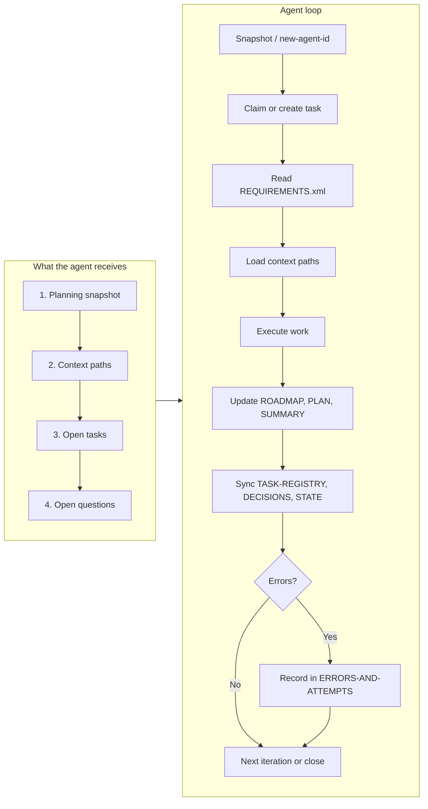

══════════════════════════════════════════════════════════════
  AGENT LOOP REPORT
══════════════════════════════════════════════════════════════

**Generated:** 2026-03-11T19:37:55.496Z  
**Format:** planning-agent-context/1.0

<details>
<summary><strong>KPIs — token usage, context per sprint phase</strong></summary>

Same as CLI: <code>planning kpis</code>

```text
PRD / REQUIREMENTS.xml
Total chars: 225320 · tokens ≈ 56339

Sprint 8 (phases: 56, 57, 58)
Task count: 12 · task-text tokens ≈ 755
Context tokens per phase (phase dirs):

56 (56-game-content-contracts-and-schema-alignment): ≈ 9772 tokens (39086 chars)
57 (undefined): ≈ 0 tokens (0 chars)
58 (58-spatial-topology-and-unreal-placement): ≈ 7132 tokens (28526 chars)

Sprint total (phase dirs + task text): ≈ 17659 tokens
```
</details>

<details>
<summary><strong>What is an agent’s workflow? (summary)</strong></summary>

1. **Snapshot** → `planning snapshot` (or `new-agent-id`) shows current phase, plan, agents, open tasks, phase progress.
2. **Get an ID** → `planning new-agent-id` prints a new id on one line (e.g. `agent-20250303-abcd`). The agent registers it in STATE.xml under `agent-registry`.
3. **Claim work** → Claim or create a task in TASK-REGISTRY.xml (phase, goal, commands).
4. **Read context** → When using the CLI (`planning simulate loop`), the bundle **serves** STATE, TASK-REGISTRY, ROADMAP, DECISIONS, and sprint phase dirs (and **always serves coding conventions**, e.g. AGENTS.md). The agent is also directed to **code file references** (from task commands + config) for implementation context.
5. **Execute** → Do the task; update ROADMAP, phase PLAN/SUMMARY; sync TASK-REGISTRY, DECISIONS, STATE.
6. **Errors** → Record in ERRORS-AND-ATTEMPTS.xml if needed.

**Outputs / references:** STATE.xml, TASK-REGISTRY.xml, ROADMAP.xml, REQUIREMENTS.xml, DECISIONS.xml, `.planning/phases/<phase>/` (PLAN.xml, SUMMARY.xml), `.planning/reports/` (this report).
</details>

<details>
<summary><strong>System health — track &amp; analyze</strong></summary>

Current snapshot (also in <code>.planning/reports/metrics.jsonl</code>; one line per <code>planning report generate</code>). Use <code>planning metrics</code> / <code>planning metrics-history --n 30</code> or fetch <code>http://localhost:3847/metrics?tail=50</code> when report server is running.

| Metric | Value |
|--------|-------|
| At | 2026-03-11T19:37:55.639Z |
| Tasks | 87 / 104 (84% done) |
| Open questions | 20 |
| Active agents | 1 |
| Phases (with tasks / total / complete) | 13 / 43 / 26 |
| Errors/attempts (ERRORS-AND-ATTEMPTS.xml) | 6 |
| Review (phases at 0% / unassigned / only planned) | 4 / 17 / 8 |
| Snapshot tokens (approx) | 2276 |
| Bundle tokens (simulate loop, approx) | 62840 |
</details>

<details>
<summary><strong>THINGS TO REVIEW</strong></summary>

Same as CLI: <code>planning review</code>

```text
Phases at 0% progress (e.g. 46: 0/1, 49: 0/1) or unassigned tasks may be skipped or abandoned. Use planning review to list them; planning review --json to output data for tools or APIs.

Phases at 0% (skipped/abandoned?)

Phase	Title	Tasks	Suggestion
46	Human-playable input UX hardening	46-01	Phase may be skipped or abandoned; consider assigning work or closing/superseding tasks.
49	Dungeon Explorer spatial visualization	49-01	Phase may be skipped or abandoned; consider assigning work or closing/superseding tasks.
53	Dolt lineage and authoring governance workflow	53-01	Phase may be skipped or abandoned; consider assigning work or closing/superseding tasks.
54	RepoPlanner submodule and host integration	54-01, 54-02	Phase may be skipped or abandoned; consider assigning work or closing/superseding tasks.

Unassigned tasks (agent-## or empty)

Task	Phase	Status	Suggestion
46-01	46	planned	Task has no real agent assigned; assign or use agent-## as placeholder until claimed.
49-01	49	planned	Task has no real agent assigned; assign or use agent-## as placeholder until claimed.
50-12	50	planned	Task has no real agent assigned; assign or use agent-## as placeholder until claimed.
51-03	51	planned	Task has no real agent assigned; assign or use agent-## as placeholder until claimed.
51-37	51	planned	Task has no real agent assigned; assign or use agent-## as placeholder until claimed.
51-38	51	planned	Task has no real agent assigned; assign or use agent-## as placeholder until claimed.
51-39	51	planned	Task has no real agent assigned; assign or use agent-## as placeholder until claimed.
51-40	51	planned	Task has no real agent assigned; assign or use agent-## as placeholder until claimed.
52-01	52	planned	Task has no real agent assigned; assign or use agent-## as placeholder until claimed.
52-02	52	planned	Task has no real agent assigned; assign or use agent-## as placeholder until claimed.
52-03	52	planned	Task has no real agent assigned; assign or use agent-## as placeholder until claimed.
52-04	52	planned	Task has no real agent assigned; assign or use agent-## as placeholder until claimed.
53-01	53	planned	Task has no real agent assigned; assign or use agent-## as placeholder until claimed.
54-01	54	planned	Task has no real agent assigned; assign or use agent-## as placeholder until claimed.
54-02	54	planned	Task has no real agent assigned; assign or use agent-## as placeholder until claimed.
55-01	55	planned	Task has no real agent assigned; assign or use agent-## as placeholder until claimed.
55-03	55	planned	Task has no real agent assigned; assign or use agent-## as placeholder until claimed.

Phases with only planned work (no in-progress)

Phase	Title	Tasks	Suggestion
46	Human-playable input UX hardening	46-01	No task in progress; may need prioritization or an agent to claim work.
49	Dungeon Explorer spatial visualization	49-01	No task in progress; may need prioritization or an agent to claim work.
50	AI integration architecture and schema-authoring workflows	50-12	No task in progress; may need prioritization or an agent to claim work.
51	Content schema file test-mode authoring loop	51-03, 51-37, 51-38, 51-39, 51-40	No task in progress; may need prioritization or an agent to claim work.
52	Unreal DLC content delivery pipeline and plugin integration	52-01, 52-02, 52-03, 52-04	No task in progress; may need prioritization or an agent to claim work.
53	Dolt lineage and authoring governance workflow	53-01	No task in progress; may need prioritization or an agent to claim work.
54	RepoPlanner submodule and host integration	54-01, 54-02	No task in progress; may need prioritization or an agent to claim work.
55	Node module dependency analysis (greenfield / brownfield)	55-01, 55-03	No task in progress; may need prioritization or an agent to claim work.
```
</details>


──────────────────────────────────────────────────────────────
  AGENT ID: what the agent sees (verbatim)
──────────────────────────────────────────────────────────────

When an agent runs **`planning new-agent-id`**, it receives exactly the following. (First: full snapshot. Then: one line with the new id.)

**1. Snapshot (exact stdout):**

```text
BEHAVIOR (AGENTS.md)

# Agent Loop Guide

XML-first planning. Use `.planning/templates/` for PLAN, SUMMARY, ROADMAP, TASK-REGISTRY, DECISIONS. Cite PRD/GRD in `references`.

**Quick start:** We have a planning CLI—run it to start. Run `planning snapshot` (or `pnpm planning snapshot` / `node scripts/loop-cli.mjs snapshot`) → register agent id in STATE.xml → claim task in TASK-REGISTRY.xml → read REQUIREMENTS.xml for phase. **When the planning MCP server (dungeonbreak-planning) is available,** prefer its tools (snapshot, open_questions, get_agent_bundle, task_update, etc.) so all agents use the same orchestration surface. Re-inject the planning bundle (get_agent_bundle or planning bundle --json) at the start of each run to avoid context rot. Greenfield work uses its own repo (see DECISIONS GREENFIELD-OWN-REPO); brownfield uses the existing repo. Setup checklists and onboarding (UI and CLI) apply to both (DECISIONS SETUP-AND-ONBOARDING). **Workflow:** Update ROADMAP, phase PLAN/SUMMARY; sync TASK-REGISTRY, DECISIONS, STATE; add `requriements-suggestions` for gaps; record errors in ERRORS-AND-ATTEMPTS.xml. **Identity:** Unique `agent-YYYYMMDD-xxxx` in STATE; `planning new-agent-id`. **Loop:** Include snapshot in updates when asked; close tasks and set inactive when done; compact refs; don’t block on open questions—capture in `requriements-suggestions`.

---

# Coding Standards &amp; Styling

**Format &amp; lint:** `pnpm dlx ultracite fix` / `ultracite check`. Biome handles most formatting; run before commit.

**TypeScript:** Explicit types where they help; `unknown` over `any`; const assertions; type narrowing over assertions; named constants over magic numbers.

**TS/JS:** Arrow callbacks; `for...of`; `?.` and `??`; template literals; destructuring; `const` by default.

**React:** Function components; hooks at top level only; full dependency arrays; unique `key` (not index); semantic HTML + ARIA (alt, headings, labels, keyboard + mouse, `&lt;button&gt;`/`&lt;nav&gt;`); no components defined inside components.

**DRY &amp; SOLID:** Don’t repeat yourself—extract shared logic and UI into reusable pieces. Single responsibility, open/closed, clear dependencies. Prefer composition over duplication.

**Components &amp; UI (don’t reinvent the wheel):** Use **shadcn/ui** first. Check the [shadcn registry](https://ui.shadcn.com) and 3rd party components built on shadcn (or Radix). Prefer lightweight, well-maintained 3rd party over custom builds. Only build custom when nothing fits.

**Icons:** Use icons for context—they’re reusable and condensed. Prefer a consistent icon set (e.g. Lucide, Radix Icons) over text labels or one-off SVGs. Use icons for actions, status, and navigation so UI stays scannable and DRY.

**UI aesthetic (senior stylist):** Emulate **PostHog-style dashboard** on **compact editor density** (Unreal/Unity-inspired). Goal: good-looking, organized UI.

- **PostHog traits:** Vibrant purple primary (#5B21B6 → #A78BFA gradient); white/near-white cards (bg-white/95 dark:bg-slate-900/80); sharp shadows (shadow-md hover:shadow-xl); bold typography (font-semibold text-base+); metric cards border-none with divider lines; charts with glassmorphism overlays.
- **Core tokens:** primary purple-500/600 (#A78BFA/#7C3AED), accent indigo-500, success green-500, bg-card white dark:slate-900/90.
- **Cards:** bg-card border-0 shadow-lg rounded-xl p-4–6 hover:shadow-2xl transition-all duration-200.
- **Typography:** text-foreground font-medium tracking-tight; text-lg for headers.
- **Metrics/Charts:** Full-width, border-t pt-4 after:border-muted/50, hover:scale-[1.02].
- **Buttons:** bg-gradient-to-r from-purple-500 to-indigo-600 hover:from-purple-600 text-white shadow-lg.
- **Layout:** Mobile stack; desktop grid-1 md:grid-cols-3 for dashboards. Extend theme (colors/shadows) in config, not one-off classes.

**When delivering UI changes:** Provide refactored TSX, config diff (colors/shadows), checklist, and **PostHog vibe score (High/Med/Low)** so we keep the aesthetic consistent.

**Styling (general):** Design tokens over magic colors; semantic class names; co-located or clear structure; Next.js `&lt;Image&gt;` where applicable.

**Errors &amp; flow:** Early returns over deep nesting; throw `Error` with clear messages; remove `console.log`/`debugger` from commits.

**Security:** `rel=&#34;noopener&#34;` with `target=&#34;_blank&#34;`; avoid `dangerouslySetInnerHTML` unless required; no `eval()`.

**Perf:** Prefer **O(1)** or **O(n log n)** over O(n) or worse; only use higher complexity when unavoidable and document why. No spread in loop accumulators; top-level regex; specific imports; proper image components. Use sets/maps for lookups; avoid repeated linear scans; sort once if needed (n log n) rather than repeated O(n) passes.

**Tests:** Assert inside `it()`/`test()`; async/await not done callbacks; no `.only`/`.skip` in repo.

Consider these when editing; run `pnpm dlx ultracite fix` before committing.


────────────────────────────────────────

STATE (.planning/STATE.xml)
agents (active):
  agent-20260310-8dp8  phase=58 plan=58-04  9/9 (100%)

OPEN TASKS (.planning/TASK-REGISTRY.xml)
  46-01 [planned] Human-playable UX hardening (agent: agent-##)
  49-01 [planned] Dungeon Explorer spatial visualization plan + layout payload. (agent: agent-##)
  50-12 [planned] Run end-to-end chat-authoring verification in Space Explorer and finalize release readiness checks for this phase. (agent: agent-##)
  51-03 [planned] Define Supabase/S3 pull/push contracts for content-pack bundles and reports, including indexing/versioning and upload provenance. (agent: agent-##)
  51-37 [planned] Continue extracting Content Creator tree/json schema/editor logic from space-explorer.tsx into reusable hooks, utilities, and shell components. (agent: agent-##)
  51-38 [planned] Add stat-modifier mapping editor in stats info panel and wire live updates into runtime model schema overrides. (agent: agent-##)
  51-39 [planned] Refactor Space Explorer vector semantics to stat-feature spaces, remove legacy trait/semantic defaults, and standardize shadcn button usage in touched UI. (agent: agent-##)
  51-40 [planned] Continue Space Explorer decomposition: fix runtime-space-plot UTF-8 compile error and keep extracting pack/report loading + state plumbing from space-explorer.tsx (agent: agent-##)
  52-01 [planned] Define Unreal DLC delivery phase baseline: add DB_Unreal_DLC_Plugin submodule and create implementation plan for downloadable packs, ingestion contracts, schema/asset alignment, and secret handling. (agent: agent-##)
  52-02 [planned] Define Supabase/S3 delivery contract and implement encrypted env bundle workflow for docs-site + Unreal plugin cross-repo operations. (agent: agent-##)
  52-03 [planned] Implement content pack publish/pull API contract with versioned manifest index and signed Supabase download URLs. (agent: agent-##)
  52-04 [planned] Document end-to-end content delivery workflow in docs-site (Content Editor, Supabase distribution, Unreal plugin consumption, Dolt lineage role), including audience and expectations. (agent: agent-##)
  53-01 [planned] Define Dolt authoring lineage workflow contract: branch strategy, merge gates, release promotion semantics, and ownership model. (agent: agent-##)
  54-01 [planned] RepoPlanner at vendor/repo-planner: add submodule, pull remote, document simple Next.js component + theme/Codex/loop integration; migrate planning code into submodule and push. (agent: agent-##)
  54-02 [planned] Package owns all planning API surface: move routes/handlers into vendor/repo-planner; add install-routes script so host can install API routes from package; standalone mode with project-folder selection; atomic design (atoms/molecules/organisms) + STYLING in package. (agent: agent-##)
  55-01 [planned] Build dependency usage analysis pipeline: static + dynamic require; product usage only (exclude test-only); machine-readable output for REQUIREMENTS.xml and phase plans. No specific dep yet—user picks after analysis ready. (agent: agent-##)
  55-03 [planned] Dependencies tab in planning cockpit: rich UI and coloring (usage table, replaceability badges green/amber/red, package → exports hierarchy). Consume analysis API from 55-01; use PanelSection, status helpers, compact tables. (agent: agent-##)

PHASE
  Progress (.planning/TASK-REGISTRY.xml)
    44: 26/26 (100%)
    45: 1/1 (100%)
    46: 0/1 (0%)  review?
    49: 0/1 (0%)  review?
    50: 11/12 (92%)
    51: 35/40 (88%)
    52: 1/5 (20%)
    53: 0/1 (0%)  review?
    54: 0/2 (0%)  review?
    55: 1/3 (33%)
    56: 5/5 (100%)
    58: 4/4 (100%)

  NEEDS REVIEW
    46, 49, 53, 54
  DEPS (tree, id title [status]) (.planning/ROADMAP.xml) — file context
    56 Generic schema alignment, ga [done]
    57 Planning package, standalone [active]
    58 Spatial topology, reusable p [done]

  Similar phases  (phase↔phase similarity%  files touched)
    56↔57 64%  docs-site, packages/engine, packages/kaplay-demo, packages/planning
    56↔58 76%  docs-site, packages/engine, packages/kaplay-demo, packages
    57↔58 64%  packages/planning, docs-site, packages
```

**2. Then one line (exact stdout):**

```text
Your new agent id: agent-20260311-repr
```

The agent adds the printed id to STATE.xml under `agent-registry` (and optionally sets phase, plan, status). **Who’s working** = agents that have claimed an id (listed in STATE.xml). Below: count and list of those agents and the **context** (task goals, phase titles) they see.


──────────────────────────────────────────────────────────────
  AGENTS IN THE REPO (1 with claimed IDs)
──────────────────────────────────────────────────────────────


- **agent-20260310-8dp8** — name: codex | phase: 58 | plan: 58-04 | status: in-progress
  <details>
  <summary>Tasks &amp; context (what this agent reads)</summary>
  
  | Task | Status | Goal | Phase |
  |------|--------|------|-------|
  | 56-01 | done | Plan the generic schema, per-game overlay, and project workflow direction: remove privileged trait and Kael semantics, define derived-space and single-source-of-truth rules, and specify how editor/explorer/codegen surfaces warn about game usability without forcing artifact-level contracts. | 56 (Generic schema alignment, game overlays, and project workflow) |
  | 56-02 | done | Implement the shared schema source, neutral generation pipeline, and test-mode import/export workflow so Escape the Dungeon can consume generated schema/classes/assets without database persistence. | 56 (Generic schema alignment, game overlays, and project workflow) |
  | 56-03 | done | Remove hard-coded Kael and privileged trait semantics from generic editor/runtime surfaces and align Space Explorer/Content Creator state with the shared schema model. | 56 (Generic schema alignment, game overlays, and project workflow) |
  | 56-04 | done | Wire Escape the Dungeon gameplay and agent-play paths to the generated schema outputs and verify the game remains playable through the agent surface. | 56 (Generic schema alignment, game overlays, and project workflow) |
  | 56-05 | done | Ship the first UI updates for schema import/export, overlay warnings, and generated-output inspection in test mode. | 56 (Generic schema alignment, game overlays, and project workflow) |
  | 58-01 | done | Document the spatial topology phase: separate reusable placement primitives from game-specific concepts, define how DungeonBreak regions/towns/wilderness/outskirts and Escape the Dungeon floors relate to shared spatial authoring, and specify the Unreal placement workflow that will consume those outputs. | 58 (Spatial topology, reusable placement primitives, and Unreal map sync) |
  | 58-02 | done | Define the spatial schema and codegen contract for reusable placement primitives, per-game spatial overlays, and Unreal placement payloads without collapsing differing gameplay concepts into one class hierarchy. | 58 (Spatial topology, reusable placement primitives, and Unreal map sync) |
  | 58-03 | done | Define the spatial editor UX and project workflow so spatial docs, warnings-only overlays, import/export, and generated outputs have a first-class project surface separate from derived-space analysis. | 58 (Spatial topology, reusable placement primitives, and Unreal map sync) |
  | 58-04 | done | Define the Unreal placement sync and diagnostics workflow using the neutral spatial contract, stable placement ids, and hand-authored map ownership boundaries. | 58 (Spatial topology, reusable placement primitives, and Unreal map sync) |
  
  
  </details>


──────────────────────────────────────────────────────────────
  WHAT THE AGENT SEES (literal inputs in workflow order)
──────────────────────────────────────────────────────────────

Exact CLI/bundle output the agent receives; each input is in a code block below.

**Current (focal):** STATE has a single **current-phase** and **current-plan** — the repo’s chosen focus (e.g. phase 50, plan 50-09). That is “who is current” at the repo level. **Phases with in-progress work** can be several: any phase that has an agent with status `in-progress` or a task with status `in-progress`. Right now: 58.

**1. SNAPSHOT (exact stdout of planning snapshot / new-agent-id)**

```text
BEHAVIOR (AGENTS.md)

# Agent Loop Guide

XML-first planning. Use `.planning/templates/` for PLAN, SUMMARY, ROADMAP, TASK-REGISTRY, DECISIONS. Cite PRD/GRD in `references`.

**Quick start:** We have a planning CLI—run it to start. Run `planning snapshot` (or `pnpm planning snapshot` / `node scripts/loop-cli.mjs snapshot`) → register agent id in STATE.xml → claim task in TASK-REGISTRY.xml → read REQUIREMENTS.xml for phase. **When the planning MCP server (dungeonbreak-planning) is available,** prefer its tools (snapshot, open_questions, get_agent_bundle, task_update, etc.) so all agents use the same orchestration surface. Re-inject the planning bundle (get_agent_bundle or planning bundle --json) at the start of each run to avoid context rot. Greenfield work uses its own repo (see DECISIONS GREENFIELD-OWN-REPO); brownfield uses the existing repo. Setup checklists and onboarding (UI and CLI) apply to both (DECISIONS SETUP-AND-ONBOARDING). **Workflow:** Update ROADMAP, phase PLAN/SUMMARY; sync TASK-REGISTRY, DECISIONS, STATE; add `requriements-suggestions` for gaps; record errors in ERRORS-AND-ATTEMPTS.xml. **Identity:** Unique `agent-YYYYMMDD-xxxx` in STATE; `planning new-agent-id`. **Loop:** Include snapshot in updates when asked; close tasks and set inactive when done; compact refs; don’t block on open questions—capture in `requriements-suggestions`.

---

# Coding Standards &amp; Styling

**Format &amp; lint:** `pnpm dlx ultracite fix` / `ultracite check`. Biome handles most formatting; run before commit.

**TypeScript:** Explicit types where they help; `unknown` over `any`; const assertions; type narrowing over assertions; named constants over magic numbers.

**TS/JS:** Arrow callbacks; `for...of`; `?.` and `??`; template literals; destructuring; `const` by default.

**React:** Function components; hooks at top level only; full dependency arrays; unique `key` (not index); semantic HTML + ARIA (alt, headings, labels, keyboard + mouse, `&lt;button&gt;`/`&lt;nav&gt;`); no components defined inside components.

**DRY &amp; SOLID:** Don’t repeat yourself—extract shared logic and UI into reusable pieces. Single responsibility, open/closed, clear dependencies. Prefer composition over duplication.

**Components &amp; UI (don’t reinvent the wheel):** Use **shadcn/ui** first. Check the [shadcn registry](https://ui.shadcn.com) and 3rd party components built on shadcn (or Radix). Prefer lightweight, well-maintained 3rd party over custom builds. Only build custom when nothing fits.

**Icons:** Use icons for context—they’re reusable and condensed. Prefer a consistent icon set (e.g. Lucide, Radix Icons) over text labels or one-off SVGs. Use icons for actions, status, and navigation so UI stays scannable and DRY.

**UI aesthetic (senior stylist):** Emulate **PostHog-style dashboard** on **compact editor density** (Unreal/Unity-inspired). Goal: good-looking, organized UI.

- **PostHog traits:** Vibrant purple primary (#5B21B6 → #A78BFA gradient); white/near-white cards (bg-white/95 dark:bg-slate-900/80); sharp shadows (shadow-md hover:shadow-xl); bold typography (font-semibold text-base+); metric cards border-none with divider lines; charts with glassmorphism overlays.
- **Core tokens:** primary purple-500/600 (#A78BFA/#7C3AED), accent indigo-500, success green-500, bg-card white dark:slate-900/90.
- **Cards:** bg-card border-0 shadow-lg rounded-xl p-4–6 hover:shadow-2xl transition-all duration-200.
- **Typography:** text-foreground font-medium tracking-tight; text-lg for headers.
- **Metrics/Charts:** Full-width, border-t pt-4 after:border-muted/50, hover:scale-[1.02].
- **Buttons:** bg-gradient-to-r from-purple-500 to-indigo-600 hover:from-purple-600 text-white shadow-lg.
- **Layout:** Mobile stack; desktop grid-1 md:grid-cols-3 for dashboards. Extend theme (colors/shadows) in config, not one-off classes.

**When delivering UI changes:** Provide refactored TSX, config diff (colors/shadows), checklist, and **PostHog vibe score (High/Med/Low)** so we keep the aesthetic consistent.

**Styling (general):** Design tokens over magic colors; semantic class names; co-located or clear structure; Next.js `&lt;Image&gt;` where applicable.

**Errors &amp; flow:** Early returns over deep nesting; throw `Error` with clear messages; remove `console.log`/`debugger` from commits.

**Security:** `rel=&#34;noopener&#34;` with `target=&#34;_blank&#34;`; avoid `dangerouslySetInnerHTML` unless required; no `eval()`.

**Perf:** Prefer **O(1)** or **O(n log n)** over O(n) or worse; only use higher complexity when unavoidable and document why. No spread in loop accumulators; top-level regex; specific imports; proper image components. Use sets/maps for lookups; avoid repeated linear scans; sort once if needed (n log n) rather than repeated O(n) passes.

**Tests:** Assert inside `it()`/`test()`; async/await not done callbacks; no `.only`/`.skip` in repo.

Consider these when editing; run `pnpm dlx ultracite fix` before committing.


────────────────────────────────────────

STATE (.planning/STATE.xml)
agents (active):
  agent-20260310-8dp8  phase=58 plan=58-04  9/9 (100%)

OPEN TASKS (.planning/TASK-REGISTRY.xml)
  46-01 [planned] Human-playable UX hardening (agent: agent-##)
  49-01 [planned] Dungeon Explorer spatial visualization plan + layout payload. (agent: agent-##)
  50-12 [planned] Run end-to-end chat-authoring verification in Space Explorer and finalize release readiness checks for this phase. (agent: agent-##)
  51-03 [planned] Define Supabase/S3 pull/push contracts for content-pack bundles and reports, including indexing/versioning and upload provenance. (agent: agent-##)
  51-37 [planned] Continue extracting Content Creator tree/json schema/editor logic from space-explorer.tsx into reusable hooks, utilities, and shell components. (agent: agent-##)
  51-38 [planned] Add stat-modifier mapping editor in stats info panel and wire live updates into runtime model schema overrides. (agent: agent-##)
  51-39 [planned] Refactor Space Explorer vector semantics to stat-feature spaces, remove legacy trait/semantic defaults, and standardize shadcn button usage in touched UI. (agent: agent-##)
  51-40 [planned] Continue Space Explorer decomposition: fix runtime-space-plot UTF-8 compile error and keep extracting pack/report loading + state plumbing from space-explorer.tsx (agent: agent-##)
  52-01 [planned] Define Unreal DLC delivery phase baseline: add DB_Unreal_DLC_Plugin submodule and create implementation plan for downloadable packs, ingestion contracts, schema/asset alignment, and secret handling. (agent: agent-##)
  52-02 [planned] Define Supabase/S3 delivery contract and implement encrypted env bundle workflow for docs-site + Unreal plugin cross-repo operations. (agent: agent-##)
  52-03 [planned] Implement content pack publish/pull API contract with versioned manifest index and signed Supabase download URLs. (agent: agent-##)
  52-04 [planned] Document end-to-end content delivery workflow in docs-site (Content Editor, Supabase distribution, Unreal plugin consumption, Dolt lineage role), including audience and expectations. (agent: agent-##)
  53-01 [planned] Define Dolt authoring lineage workflow contract: branch strategy, merge gates, release promotion semantics, and ownership model. (agent: agent-##)
  54-01 [planned] RepoPlanner at vendor/repo-planner: add submodule, pull remote, document simple Next.js component + theme/Codex/loop integration; migrate planning code into submodule and push. (agent: agent-##)
  54-02 [planned] Package owns all planning API surface: move routes/handlers into vendor/repo-planner; add install-routes script so host can install API routes from package; standalone mode with project-folder selection; atomic design (atoms/molecules/organisms) + STYLING in package. (agent: agent-##)
  55-01 [planned] Build dependency usage analysis pipeline: static + dynamic require; product usage only (exclude test-only); machine-readable output for REQUIREMENTS.xml and phase plans. No specific dep yet—user picks after analysis ready. (agent: agent-##)
  55-03 [planned] Dependencies tab in planning cockpit: rich UI and coloring (usage table, replaceability badges green/amber/red, package → exports hierarchy). Consume analysis API from 55-01; use PanelSection, status helpers, compact tables. (agent: agent-##)

PHASE
  Progress (.planning/TASK-REGISTRY.xml)
    44: 26/26 (100%)
    45: 1/1 (100%)
    46: 0/1 (0%)  review?
    49: 0/1 (0%)  review?
    50: 11/12 (92%)
    51: 35/40 (88%)
    52: 1/5 (20%)
    53: 0/1 (0%)  review?
    54: 0/2 (0%)  review?
    55: 1/3 (33%)
    56: 5/5 (100%)
    58: 4/4 (100%)

  NEEDS REVIEW
    46, 49, 53, 54
  DEPS (tree, id title [status]) (.planning/ROADMAP.xml) — file context
    56 Generic schema alignment, ga [done]
    57 Planning package, standalone [active]
    58 Spatial topology, reusable p [done]

  Similar phases  (phase↔phase similarity%  files touched)
    56↔57 64%  docs-site, packages/engine, packages/kaplay-demo, packages/planning
    56↔58 76%  docs-site, packages/engine, packages/kaplay-demo, packages
    57↔58 64%  packages/planning, docs-site, packages
```

**2. NEW AGENT ID LINE (exact stdout when running planning new-agent-id)**

```text
Your new agent id: agent-20260311-repr
```

**3. CONTEXT PATHS (exact list from bundle, one per line)**

```text
.planning\STATE.xml
.planning\TASK-REGISTRY.xml
.planning\ROADMAP.xml
.planning\REQUIREMENTS.xml
.planning\DECISIONS.xml
.planning\phases\56-game-content-contracts-and-schema-alignment
.planning\phases\58-spatial-topology-and-unreal-placement
```

*In bundle:* conventions AGENTS.md · code refs 19 paths

**4. OPEN TASKS (exact format from snapshot/bundle)**

```text

- 46-01 [planned] Human-playable UX hardening (agent: agent-##)
- 49-01 [planned] Dungeon Explorer spatial visualization plan + layout payload. (agent: agent-##)
- 50-12 [planned] Run end-to-end chat-authoring verification in Space Explorer and finalize release readiness checks for this phase. (agent: agent-##)
- 51-03 [planned] Define Supabase/S3 pull/push contracts for content-pack bundles and reports, including indexing/versioning and upload provenance. (agent: agent-##)
- 51-37 [planned] Continue extracting Content Creator tree/json schema/editor logic from space-explorer.tsx into reusable hooks, utilities, and shell components. (agent: agent-##)
- 51-38 [planned] Add stat-modifier mapping editor in stats info panel and wire live updates into runtime model schema overrides. (agent: agent-##)
- 51-39 [planned] Refactor Space Explorer vector semantics to stat-feature spaces, remove legacy trait/semantic defaults, and standardize shadcn button usage in touched UI. (agent: agent-##)
- 51-40 [planned] Continue Space Explorer decomposition: fix runtime-space-plot UTF-8 compile error and keep extracting pack/report loading + state plumbing from space-explorer.tsx (agent: agent-##)
- 52-01 [planned] Define Unreal DLC delivery phase baseline: add DB_Unreal_DLC_Plugin submodule and create implementation plan for downloadable packs, ingestion contracts, schema/asset alignment, and secret handling. (agent: agent-##)
- 52-02 [planned] Define Supabase/S3 delivery contract and implement encrypted env bundle workflow for docs-site + Unreal plugin cross-repo operations. (agent: agent-##)
- 52-03 [planned] Implement content pack publish/pull API contract with versioned manifest index and signed Supabase download URLs. (agent: agent-##)
- 52-04 [planned] Document end-to-end content delivery workflow in docs-site (Content Editor, Supabase distribution, Unreal plugin consumption, Dolt lineage role), including audience and expectations. (agent: agent-##)
- 53-01 [planned] Define Dolt authoring lineage workflow contract: branch strategy, merge gates, release promotion semantics, and ownership model. (agent: agent-##)
- 54-01 [planned] RepoPlanner at vendor/repo-planner: add submodule, pull remote, document simple Next.js component + theme/Codex/loop integration; migrate planning code into submodule and push. (agent: agent-##)
- 54-02 [planned] Package owns all planning API surface: move routes/handlers into vendor/repo-planner; add install-routes script so host can install API routes from package; standalone mode with project-folder selection; atomic design (atoms/molecules/organisms) + STYLING in package. (agent: agent-##)
- 55-01 [planned] Build dependency usage analysis pipeline: static + dynamic require; product usage only (exclude test-only); machine-readable output for REQUIREMENTS.xml and phase plans. No specific dep yet—user picks after analysis ready. (agent: agent-##)
- 55-03 [planned] Dependencies tab in planning cockpit: rich UI and coloring (usage table, replaceability badges green/amber/red, package → exports hierarchy). Consume analysis API from 55-01; use PanelSection, status helpers, compact tables. (agent: agent-##)


```

**5. OPEN QUESTIONS (exact format from bundle)**

```text

- [50] 50-01-q-po-channel: How does the Product Owner agent get exposed so Codex CLI / app server agents can talk to it? (MCP server tool, Codex SDK agent, or both?)
- [50] 50-01-q-questions-flow: Where do phase questions live (inline in PLAN, or separate file) and how does the PO or CLI update DECISIONS/REQUIREMENTS from answers?
- [50] 50-02-q-flag-backend: Where should flag evaluation live first: existing app server runtime config, or a dedicated flag service?
- [50] 50-02-q-default-lane: Do we commit to lane B (hybrid third-party) as default fast path unless blocked by compliance or cost?
- [50] 50-02-q-exit-criteria: Lane switch thresholds: what numeric values trigger switching away from the current acceleration lane? (e.g. delivery slip %, incident rate, cost per active user—the “exit criteria” for the current lane.)
- [52] 52-01-q-signing: Do we sign pack manifests only, or full payload chunks + manifest hash chain?
- [52] 52-01-q-distribution: Primary pack distribution endpoint: GitHub Releases, S3/Supabase, or dual-publish with immutable version index?
- [52] 52-01-q-plugin-runtime: Should plugin import on editor-time only first, or support runtime fetch/load in packaged builds in phase 52 scope?
- [52] 52-02-q-supabase-bucket: Use one bucket with namespaced prefixes (`packs/`, `manifests/`, `reports/`) or dedicated buckets per artifact class?
- [52] 52-02-q-signed-url-ttl: Default signed URL TTL for plugin downloads: short-lived (5-15m) vs medium-lived (1h) with refresh flow?
- [52] 52-02-q-key-management: Should env bundle key live only in local shell + CI secret store, or also in an internal password manager with rotation cadence?
- [52] 52-02-q-dolt-runtime-dependency: Should Unreal plugin/runtime ever depend on Dolt directly, or remain fully decoupled with Dolt only on authoring/build side?
- [52] 52-03-q-auth: Will publish endpoints be restricted to internal CI/service accounts only, or also admin UI users?
- [52] 52-03-q-compat-filter: Should pull endpoint enforce compatibility filtering server-side or return candidate versions with client-side selection?
- [53] 53-01-q-branching: What Dolt branch model best matches team ownership (main/release/feature vs environment branches)?
- [53] 53-01-q-promotion: What exact approvals are required before promoting Dolt-derived patches to downloadable runtime artifacts?
- [58] 58-01-q-placement-boundary: What is the smallest neutral placement primitive set that remains reusable across both games: region, level, room, anchor, area, lane, encounter socket, something else?
- [58] 58-01-q-topology-layering: Should game-specific topology be represented as overlays on top of placement primitives, or as separate schema modules that compile to a shared placement payload?
- [58] 58-01-q-unreal-ownership: How much of an Unreal map remains hand-authored versus generated or updated from content placement payloads?
- [58] 58-01-q-room-reuse: Which room concepts are actually reusable between DungeonBreak and Escape the Dungeon, and which need separate semantic wrappers despite sharing transforms and placement anchors?


```


──────────────────────────────────────────────────────────────
  AGENT LOOP WORKFLOW (Mermaid)
──────────────────────────────────────────────────────────────


```mermaid
flowchart LR
  subgraph inputs[" What the agent receives "]
    A[1. Planning snapshot] --> B[2. Context paths]
    B --> C[3. Open tasks]
    C --> D[4. Open questions]
  end

  subgraph loop[" Agent loop "]
    E[Snapshot / new-agent-id] --> F[Claim or create task]
    F --> G[Read REQUIREMENTS.xml]
    G --> H[Load context paths]
    H --> I[Execute work]
    I --> J[Update ROADMAP, PLAN, SUMMARY]
    J --> K[Sync TASK-REGISTRY, DECISIONS, STATE]
    K --> L{Errors?}
    L -->|Yes| M[Record in ERRORS-AND-ATTEMPTS]
    L -->|No| N[Next iteration or close]
    M --> N
  end

  inputs --> loop
```


```mermaid
flowchart TD
  Start([Start]) --> Snapshot[planning snapshot]
  Snapshot --> Register[Register agent id in STATE.xml]
  Register --> Claim[Claim or create task in TASK-REGISTRY]
  Claim --> ReadReq[Read REQUIREMENTS.xml for PRD/GRD]
  ReadReq --> LoadCtx[Load context: STATE, TASK-REGISTRY, ROADMAP, REQUIREMENTS, DECISIONS + phase dirs]
  LoadCtx --> Execute[Execute work]
  Execute --> Update[Update ROADMAP, PLAN, SUMMARY, TASK-REGISTRY, STATE]
  Update --> Errors{Errors?}
  Errors -->|Yes| RecordErr[Record in ERRORS-AND-ATTEMPTS.xml]
  Errors -->|No| Next[Next iteration]
  RecordErr --> Next
  Next --> Snapshot
```


──────────────────────────────────────────────────────────────
  1. SNAPSHOT
──────────────────────────────────────────────────────────────

| Field | Value |
|-------|--------|
| Current phase | 58 |
| Current plan | 58-04 |
| Status | complete |

**Next action:** Phase 58 is complete. Spatial topology, editor UX, and Unreal placement workflow contracts are documented; use them as the execution baseline for future schema/runtime/plugin implementation work.

### Agents


| Id | Name | Phase | Status |
|----|------|-------|--------|
| agent-20260310-8dp8 | codex | 58 | in-progress |


──────────────────────────────────────────────────────────────
  2. CONTEXT (Sprint 8) — Paths the agent loads
──────────────────────────────────────────────────────────────

**Phase IDs in sprint:** 56, 57, 58  
**Task count in sprint:** 12

#### Phases in sprint


- **56** Generic schema alignment, game overlays, and project workflow — Complete

- **57** Planning package, standalone, and setup — In Progress

- **58** Spatial topology, reusable placement primitives, and Unreal map sync — Complete


#### Exact paths (literal list given to the AI)


- `.planning\STATE.xml`

- `.planning\TASK-REGISTRY.xml`

- `.planning\ROADMAP.xml`

- `.planning\REQUIREMENTS.xml`

- `.planning\DECISIONS.xml`

- `.planning\phases\56-game-content-contracts-and-schema-alignment`

- `.planning\phases\58-spatial-topology-and-unreal-placement`


──────────────────────────────────────────────────────────────
  3. OPEN TASKS
──────────────────────────────────────────────────────────────


| Id | Status | Agent | Goal |
|----|--------|-------|------|
| 46-01 | planned | agent-## | Human-playable UX hardening |
| 49-01 | planned | agent-## | Dungeon Explorer spatial visualization plan + layout payload. |
| 50-12 | planned | agent-## | Run end-to-end chat-authoring verification in Space Explorer and finalize release readiness checks for this phase. |
| 51-03 | planned | agent-## | Define Supabase/S3 pull/push contracts for content-pack bundles and reports, including indexing/versioning and upload provenance. |
| 51-37 | planned | agent-## | Continue extracting Content Creator tree/json schema/editor logic from space-explorer.tsx into reusable hooks, utilities, and shell components. |
| 51-38 | planned | agent-## | Add stat-modifier mapping editor in stats info panel and wire live updates into runtime model schema overrides. |
| 51-39 | planned | agent-## | Refactor Space Explorer vector semantics to stat-feature spaces, remove legacy trait/semantic defaults, and standardize shadcn button usage in touched UI. |
| 51-40 | planned | agent-## | Continue Space Explorer decomposition: fix runtime-space-plot UTF-8 compile error and keep extracting pack/report loading + state plumbing from space-explorer.tsx |
| 52-01 | planned | agent-## | Define Unreal DLC delivery phase baseline: add DB_Unreal_DLC_Plugin submodule and create implementation plan for downloadable packs, ingestion contracts, schema/asset alignment, and secret handling. |
| 52-02 | planned | agent-## | Define Supabase/S3 delivery contract and implement encrypted env bundle workflow for docs-site + Unreal plugin cross-repo operations. |
| 52-03 | planned | agent-## | Implement content pack publish/pull API contract with versioned manifest index and signed Supabase download URLs. |
| 52-04 | planned | agent-## | Document end-to-end content delivery workflow in docs-site (Content Editor, Supabase distribution, Unreal plugin consumption, Dolt lineage role), including audience and expectations. |
| 53-01 | planned | agent-## | Define Dolt authoring lineage workflow contract: branch strategy, merge gates, release promotion semantics, and ownership model. |
| 54-01 | planned | agent-## | RepoPlanner at vendor/repo-planner: add submodule, pull remote, document simple Next.js component + theme/Codex/loop integration; migrate planning code into submodule and push. |
| 54-02 | planned | agent-## | Package owns all planning API surface: move routes/handlers into vendor/repo-planner; add install-routes script so host can install API routes from package; standalone mode with project-folder selection; atomic design (atoms/molecules/organisms) + STYLING in package. |
| 55-01 | planned | agent-## | Build dependency usage analysis pipeline: static + dynamic require; product usage only (exclude test-only); machine-readable output for REQUIREMENTS.xml and phase plans. No specific dep yet—user picks after analysis ready. |
| 55-03 | planned | agent-## | Dependencies tab in planning cockpit: rich UI and coloring (usage table, replaceability badges green/amber/red, package → exports hierarchy). Consume analysis API from 55-01; use PanelSection, status helpers, compact tables. |


──────────────────────────────────────────────────────────────
  4. OPEN QUESTIONS
──────────────────────────────────────────────────────────────


- **[50]** 50-01-q-po-channel: How does the Product Owner agent get exposed so Codex CLI / app server agents can talk to it? (MCP server tool, Codex SDK agent, or both?)

- **[50]** 50-01-q-questions-flow: Where do phase questions live (inline in PLAN, or separate file) and how does the PO or CLI update DECISIONS/REQUIREMENTS from answers?

- **[50]** 50-02-q-flag-backend: Where should flag evaluation live first: existing app server runtime config, or a dedicated flag service?

- **[50]** 50-02-q-default-lane: Do we commit to lane B (hybrid third-party) as default fast path unless blocked by compliance or cost?

- **[50]** 50-02-q-exit-criteria: Lane switch thresholds: what numeric values trigger switching away from the current acceleration lane? (e.g. delivery slip %, incident rate, cost per active user—the “exit criteria” for the current lane.)

- **[52]** 52-01-q-signing: Do we sign pack manifests only, or full payload chunks + manifest hash chain?

- **[52]** 52-01-q-distribution: Primary pack distribution endpoint: GitHub Releases, S3/Supabase, or dual-publish with immutable version index?

- **[52]** 52-01-q-plugin-runtime: Should plugin import on editor-time only first, or support runtime fetch/load in packaged builds in phase 52 scope?

- **[52]** 52-02-q-supabase-bucket: Use one bucket with namespaced prefixes (`packs/`, `manifests/`, `reports/`) or dedicated buckets per artifact class?

- **[52]** 52-02-q-signed-url-ttl: Default signed URL TTL for plugin downloads: short-lived (5-15m) vs medium-lived (1h) with refresh flow?

- **[52]** 52-02-q-key-management: Should env bundle key live only in local shell + CI secret store, or also in an internal password manager with rotation cadence?

- **[52]** 52-02-q-dolt-runtime-dependency: Should Unreal plugin/runtime ever depend on Dolt directly, or remain fully decoupled with Dolt only on authoring/build side?

- **[52]** 52-03-q-auth: Will publish endpoints be restricted to internal CI/service accounts only, or also admin UI users?

- **[52]** 52-03-q-compat-filter: Should pull endpoint enforce compatibility filtering server-side or return candidate versions with client-side selection?

- **[53]** 53-01-q-branching: What Dolt branch model best matches team ownership (main/release/feature vs environment branches)?

- **[53]** 53-01-q-promotion: What exact approvals are required before promoting Dolt-derived patches to downloadable runtime artifacts?

- **[58]** 58-01-q-placement-boundary: What is the smallest neutral placement primitive set that remains reusable across both games: region, level, room, anchor, area, lane, encounter socket, something else?

- **[58]** 58-01-q-topology-layering: Should game-specific topology be represented as overlays on top of placement primitives, or as separate schema modules that compile to a shared placement payload?

- **[58]** 58-01-q-unreal-ownership: How much of an Unreal map remains hand-authored versus generated or updated from content placement payloads?

- **[58]** 58-01-q-room-reuse: Which room concepts are actually reusable between DungeonBreak and Escape the Dungeon, and which need separate semantic wrappers despite sharing transforms and placement anchors?


══════════════════════════════════════════════════════════════
